# System Architecture — Deep Dive

> Comprehensive technical documentation of CheckMyData.ai internals.
> For a quick overview see [ARCHITECTURE.md](../ARCHITECTURE.md).

---

## Table of Contents

1. [System Overview and Component Map](#1-system-overview-and-component-map)
2. [Agent Orchestrator](#2-agent-orchestrator)
3. [Memory System](#3-memory-system)
4. [LLM Integration and OpenRouter](#4-llm-integration-and-openrouter)
5. [Self-Learning and Feedback Loops](#5-self-learning-and-feedback-loops)
6. [User Interaction Flow](#6-user-interaction-flow)
7. [Knowledge Layer (RAG)](#7-knowledge-layer-rag)
8. [Data Flow Diagrams](#8-data-flow-diagrams)

---

## 1. System Overview and Component Map

CheckMyData.ai is an AI-powered database query agent. Users connect databases (PostgreSQL, MySQL, ClickHouse, MongoDB), link Git repositories, and ask questions in natural language. The system translates questions into SQL, executes them, validates the results, and renders rich visualizations — all while learning from every interaction.

### Technology Stack

| Layer | Technology |
|-------|-----------|
| Frontend | Next.js 15, React 19, TypeScript, Tailwind CSS 4, Zustand |
| Backend | Python 3.12, FastAPI, SQLAlchemy 2.0 (async), Alembic |
| LLM Providers | OpenAI, Anthropic, OpenRouter (any model) |
| Vector Store | ChromaDB |
| App Database | SQLite (dev) / PostgreSQL (prod) |
| User Databases | PostgreSQL, MySQL, ClickHouse, MongoDB |
| Deployment | Docker, Heroku, DigitalOcean App Platform |

### Module Decomposition

```
backend/app/
├── agents/                 # Multi-agent orchestration system
│   ├── orchestrator.py     # Main coordinator (OrchestratorAgent)
│   ├── sql_agent.py        # SQL generation, validation, execution
│   ├── knowledge_agent.py  # RAG-powered codebase search
│   ├── viz_agent.py        # Visualization type selection
│   ├── mcp_source_agent.py # External MCP data source queries
│   ├── query_planner.py    # Multi-stage plan decomposition
│   ├── stage_executor.py   # Pipeline stage runner
│   ├── stage_validator.py  # Per-stage result validation
│   ├── stage_context.py    # Pipeline state (ExecutionPlan, StageResult)
│   ├── base.py             # AgentContext, AgentResult, BaseAgent
│   ├── validation.py       # Inter-agent result validation
│   ├── errors.py           # AgentError hierarchy
│   ├── prompts/            # System prompt builders
│   └── tools/              # Meta-tool definitions
├── llm/                    # LLM provider abstraction
│   ├── router.py           # LLMRouter with fallback + retry
│   ├── base.py             # Message, Tool, ToolCall, LLMResponse
│   ├── errors.py           # Unified LLM error hierarchy
│   ├── openai_adapter.py   # OpenAI SDK adapter
│   ├── anthropic_adapter.py# Anthropic SDK adapter
│   └── openrouter_adapter.py # OpenRouter HTTP adapter
├── core/                   # Cross-cutting concerns
│   ├── agent.py            # ConversationalAgent wrapper
│   ├── context_budget.py   # Token budget allocator
│   ├── history_trimmer.py  # Chat history trimming + summarization
│   ├── insight_memory.py   # Persistent insight store
│   ├── validation_loop.py  # SQL pre/execute/post/repair cycle
│   ├── workflow_tracker.py # SSE event broadcasting
│   ├── context_enricher.py # Failed-query context repair
│   ├── health_monitor.py   # System health checks
│   └── ...
├── connectors/             # Database connectivity
│   ├── postgres.py, mysql.py, mongodb.py, clickhouse.py
│   ├── ssh_tunnel.py       # SSH tunnel for remote DBs
│   └── mcp_client.py       # MCP protocol client
├── knowledge/              # RAG pipeline and analysis
│   ├── vector_store.py     # ChromaDB wrapper
│   ├── repo_analyzer.py    # Git repo indexing
│   ├── learning_analyzer.py# Heuristic + LLM lesson extraction
│   ├── entity_extractor.py # Code entity extraction
│   └── custom_rules.py     # Project-specific rules engine
├── services/               # Business logic
│   ├── chat_service.py     # Session + message CRUD
│   ├── agent_learning_service.py # Learning lifecycle
│   ├── session_notes_service.py  # Working memory
│   ├── feedback_pipeline.py      # Feedback processing
│   ├── rag_feedback_service.py   # RAG quality tracking
│   ├── suggestion_engine.py      # Follow-up suggestions
│   └── ...
├── models/                 # SQLAlchemy ORM models
│   ├── chat_session.py     # ChatSession, ChatMessage
│   ├── agent_learning.py   # AgentLearning, AgentLearningSummary
│   ├── session_note.py     # SessionNote (working memory)
│   ├── insight_record.py   # InsightRecord, TrustScore
│   ├── pipeline_run.py     # PipelineRun (multi-stage state)
│   ├── data_validation.py  # DataValidationFeedback
│   ├── rag_feedback.py     # RAGFeedback
│   └── ...
├── api/routes/             # REST API endpoints
│   ├── chat.py             # Chat, streaming, feedback
│   ├── models.py           # LLM model listing
│   ├── connections.py      # Database connections
│   ├── projects.py         # Project CRUD + LLM settings
│   └── ...
├── mcp_server/             # MCP server for external clients
├── pipelines/              # Long-running workflows
└── main.py                 # FastAPI app entry point

frontend/src/
├── app/                    # Next.js App Router pages
├── components/
│   ├── chat/               # ChatPanel, ChatMessage, ChatInput, streaming
│   ├── viz/                # DataTable, charts, visualizations
│   ├── connections/        # Database connection management
│   ├── learnings/          # LearningsPanel
│   ├── insights/           # InsightsPanel
│   ├── analytics/          # FeedbackAnalyticsPanel
│   └── ui/                 # LlmModelSelector, modals, buttons
├── stores/                 # Zustand state management
│   ├── app-store.ts        # Active session, project
│   ├── auth-store.ts       # Authentication
│   └── ...
├── hooks/                  # React hooks (useRestoreState, etc.)
└── lib/                    # API client, SSE, utilities
```

---

## 2. Agent Orchestrator

The orchestrator is the central brain of the system. It receives a natural language question, decides what to do, delegates to specialist sub-agents, validates results, and composes the final answer.

### 2.1 Architecture Overview

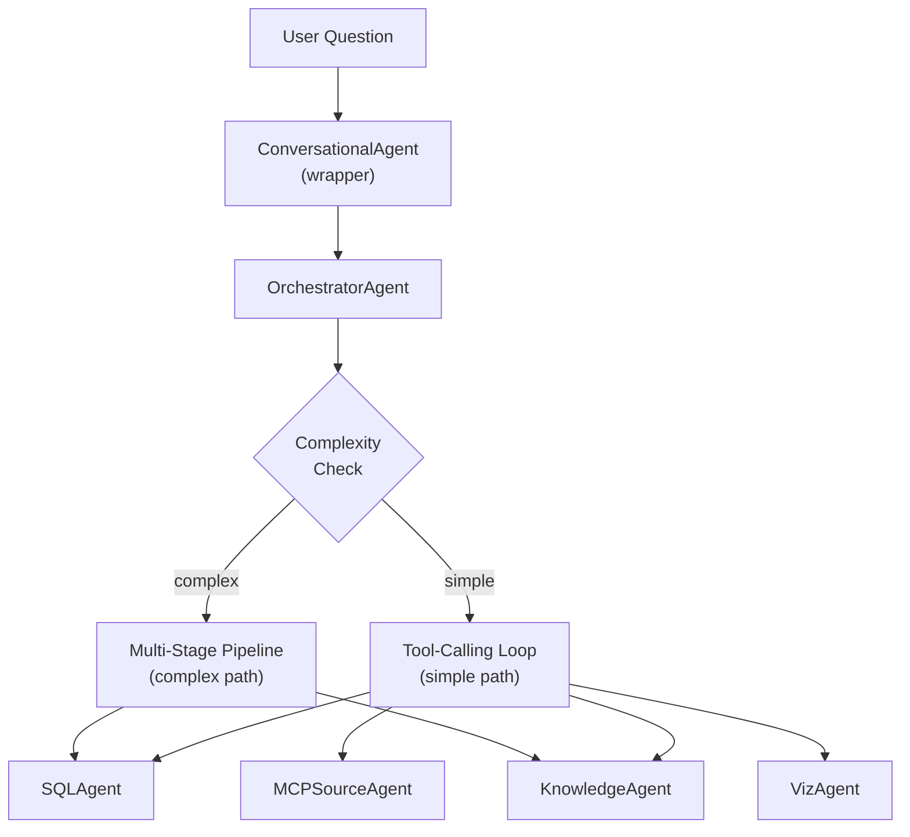

### 2.2 Entry Point

The chat route (`backend/app/api/routes/chat.py`) holds a singleton `ConversationalAgent` instance. This is a thin backward-compatible wrapper defined in `backend/app/core/agent.py` that delegates everything to `OrchestratorAgent`:

```python
class ConversationalAgent:
    def __init__(self, ...):
        self._orchestrator = OrchestratorAgent(...)

    async def run(self, question, project_id, ...):
        context = AgentContext(...)
        return await self._orchestrator.run(context)
```

### 2.3 AgentContext — The Shared State Object

Every sub-agent receives the same `AgentContext` (defined in `backend/app/agents/base.py`):

| Field | Type | Purpose |
|-------|------|---------|
| `project_id` | `str` | Workspace identifier |
| `connection_config` | `ConnectionConfig \| None` | Database credentials + type |
| `user_question` | `str` | The natural language question |
| `chat_history` | `list[Message]` | Recent conversation messages |
| `llm_router` | `LLMRouter` | LLM provider with retry/fallback |
| `tracker` | `WorkflowTracker` | SSE event emitter |
| `workflow_id` | `str` | Unique ID for this request |
| `user_id` | `str \| None` | Authenticated user |
| `preferred_provider` | `str \| None` | e.g. "openrouter" |
| `model` | `str \| None` | e.g. "openai/gpt-4o" |
| `sql_provider` / `sql_model` | `str \| None` | Separate model for SQL generation |
| `project_name` | `str \| None` | Human-readable project name |
| `extra` | `dict` | Pipeline action, session ID, flags |

### 2.4 Simple Query Flow (Tool-Calling Loop)

For straightforward questions, the orchestrator uses an iterative tool-calling loop:

**Step 1 — Context Loading (parallel)**

The orchestrator loads three context sources simultaneously using `asyncio.gather`:
- **Staleness check**: how far behind the knowledge base is from Git HEAD
- **MCP source check**: whether the project has MCP-type connections
- **Knowledge base check**: whether ChromaDB has indexed documents

**Step 2 — History Trimming**

Chat history is trimmed to fit within `max_history_tokens` using `HistoryTrimmer`:
- Large tool results are condensed to 500 chars
- Older messages are summarized via an LLM call (or dropped if no LLM available)
- A summary message replaces the collapsed messages

**Step 3 — Context Budget Allocation**

`ContextBudgetManager` allocates token budget by priority:

| Priority | Component | Budget Share |
|----------|-----------|-------------|
| 1 (highest) | System prompt | Fixed (never truncated) |
| 2 | Chat history | 30% of total |
| 3 | Schema / table map | 25% of total |
| 4 | Custom rules | 10% of total |
| 5 | Agent learnings | 8% of total |
| 6 (lowest) | Project overview | Remainder |

Each component is truncated to fit its budget if necessary.

**Step 4 — System Prompt Construction**

`build_orchestrator_system_prompt()` (`backend/app/agents/prompts/orchestrator_prompt.py`) assembles the system prompt dynamically based on available capabilities:
- Available tools section (conditional on `has_connection`, `has_knowledge_base`, `has_mcp_sources`)
- Database table map for routing context
- Project knowledge overview
- Recent agent learnings (verified patterns from past interactions)
- Data verification protocol guidelines
- Complex multi-step query instructions

**Step 5 — Tool-Calling Loop (Adaptive Step Budget)**

The loop runs up to `max_orchestrator_iterations` (default 25, configurable in settings and overrideable per-project or per-request via `max_steps`):

```
for each iteration:
    1. Trim loop messages if approaching context limit
    2. Inject "wrap up" message if near 70% context capacity
    3. Inject step-budget wrap-up if ≤ orchestrator_wrap_up_steps remain
    4. Call LLM with messages + tools
    5. If no tool calls → final text answer, break
    6. If tool calls:
       a. Dispatch to sub-agents (parallel if multiple, sequential for process_data)
       b. Append assistant message + tool results to message list
       c. Continue loop
else (loop exhausted):
    7. Final LLM synthesis call (no tools, summarize collected data)
    8. Return step_limit_reached response with continuation_context
```

**Parallel tool execution**: When the LLM requests multiple tools (except `process_data`), they are dispatched concurrently via `asyncio.gather`. Failures in parallel calls are caught individually and reported as error strings.

**Context pressure management**: As the loop progresses and context fills up:
- At 80% capacity: older assistant+tool pairs are collapsed into summaries
- At 70% capacity: a system message instructs the LLM to stop making tool calls and compose a final answer
- On token limit error: context is aggressively compressed to 60% and retried

**Step-budget awareness**: When `orchestrator_wrap_up_steps` (default 3) iterations remain, the LLM receives a system message urging it to compose a final answer. This works alongside context-pressure wrap-up.

**Final synthesis on exhaustion**: When `orchestrator_final_synthesis` is enabled (default), the orchestrator makes one final LLM call without tools to synthesize all collected data into a coherent answer — instead of returning a static "maximum steps reached" message.

**Continuation protocol**: When the step limit is reached, the response includes `response_type: "step_limit_reached"`, `steps_used`, `steps_total`, and a `continuation_context` payload. The frontend renders a "Continue analysis" button that resends the request with `pipeline_action: "continue_analysis"`, allowing the user to resume the analysis.

**Step 6 — Visualization Selection**

If the response includes SQL results, the `VizAgent` selects the best chart type. The `AgentResultValidator` then checks the visualization (e.g., pie chart with too many slices falls back to bar chart).

**Step 7 — Follow-up Suggestions**

`SuggestionEngine.generate_followups()` produces 2-3 suggested follow-up questions based on the query, columns, and row count.

### 2.5 Complex Query Flow (Multi-Stage Pipeline)

For questions requiring multiple data retrieval steps, the orchestrator switches to a multi-stage pipeline.

**Complexity detection** uses two levels:

1. **Heuristic check** (`detect_complexity()`): scans for keywords like "summary table", "pivot", "cross-reference", "compare", "for each", "step 1", etc.
2. **Adaptive LLM check** (`detect_complexity_adaptive()`): a lightweight LLM call that returns "simple" or "complex" — used only if the heuristic is inconclusive.

**Pipeline execution**:

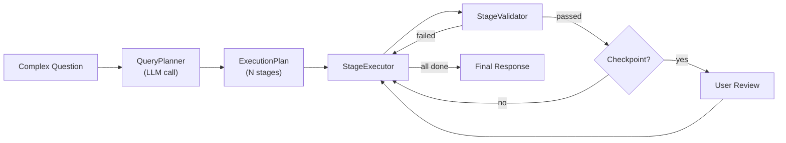

**Components**:

| Component | File | Role |
|-----------|------|------|
| `QueryPlanner` | `backend/app/agents/query_planner.py` | Decomposes question into `ExecutionPlan` via a single LLM call |
| `ExecutionPlan` | `backend/app/agents/stage_context.py` | Ordered list of `PlanStage` objects with descriptions, SQL hints, validation criteria |
| `StageExecutor` | `backend/app/agents/stage_executor.py` | Runs stages sequentially: SQL agent call → validation → checkpoint → next |
| `StageValidator` | `backend/app/agents/stage_validator.py` | Checks data shape, row-count bounds, cross-stage consistency |
| `StageContext` | `backend/app/agents/stage_context.py` | In-memory pipeline state: plan, results per stage, user feedback |
| `PipelineRun` | `backend/app/models/pipeline_run.py` | DB-persisted pipeline state for resume/retry |

**Checkpoint mechanism**: Stages can be flagged as checkpoints. When a checkpoint stage completes, the orchestrator pauses and presents intermediate results to the user with options to **continue**, **modify**, or **retry**. The user's response is processed via `_resume_pipeline()` which reconstitutes `StageContext` from the DB and continues execution.

**Fallback**: If the planner fails to produce a valid plan, the orchestrator falls back to the simple tool-calling loop with a `_skip_complexity` flag to prevent infinite recursion.

### 2.6 Meta-Tools

The orchestrator's LLM sees these meta-tools (defined in `backend/app/agents/tools/orchestrator_tools.py`):

| Tool | When Available | Sub-Agent | Description |
|------|---------------|-----------|-------------|
| `query_database` | DB connected | `SQLAgent` | Generates, validates, and executes SQL |
| `search_codebase` | KB indexed | `KnowledgeAgent` | RAG search over indexed code/docs |
| `manage_rules` | DB connected | Direct (RuleService) | CRUD for project rules |
| `query_mcp_source` | MCP connections | `MCPSourceAgent` | Query external MCP data sources |
| `process_data` | DB connected | `DataProcessor` | In-memory data enrichment (IP→country, phone→country, aggregate, filter) |
| `ask_user` | DB connected | None (raises exception) | Structured clarification question |

Tools are assembled dynamically by `get_orchestrator_tools()` based on what the project has configured.

### 2.7 Sub-Agent Retry Logic

Each sub-agent call is wrapped in retry logic with `MAX_SUB_AGENT_RETRIES = 2`:

```
for attempt in range(MAX_SUB_AGENT_RETRIES + 1):
    try:
        result = await sub_agent.run(context, ...)
        validation = validator.validate(result)
        if validation.passed or attempt == MAX_SUB_AGENT_RETRIES:
            return result
    except AgentRetryableError:
        continue  # retry
    except AgentFatalError:
        return error  # no retry
```

The `AgentResultValidator` (`backend/app/agents/validation.py`) checks:
- **SQL results**: query present, no execution error, warns on zero rows or slow queries (>30s)
- **Viz results**: valid viz_type, appropriate chart for data shape
- **Knowledge results**: non-empty answer, source citations present

### 2.8 Error Handling

The error hierarchy (`backend/app/agents/errors.py`):

```
AgentError (base)
├── AgentTimeoutError      → retry with adjusted context
├── AgentRetryableError    → orchestrator may retry
├── AgentFatalError        → unrecoverable (missing connection, auth failure)
└── AgentValidationError   → sub-agent result failed checks
```

The orchestrator catches different error types and produces appropriate user-facing messages:
- Connection errors → "Please check your connection settings"
- Permission errors → "Please check your database credentials"
- LLM errors → provider-specific user messages from the error hierarchy
- Unknown errors → generic "An unexpected error occurred"

### 2.9 Clarification Requests

When the orchestrator's LLM calls `ask_user`, it raises `_ClarificationRequestError` which interrupts the tool loop and returns an `AgentResponse` with `response_type="clarification_request"`. The payload includes:
- `question`: what to ask the user
- `question_type`: `yes_no`, `multiple_choice`, `numeric_range`, or `free_text`
- `options`: for multiple choice questions
- `context`: explanation of why the question is being asked

The frontend renders this as a special UI component and sends the user's answer as the next message.

---

## 3. Memory System

The system implements a four-layer memory architecture, each with different scope, persistence, and decay characteristics.

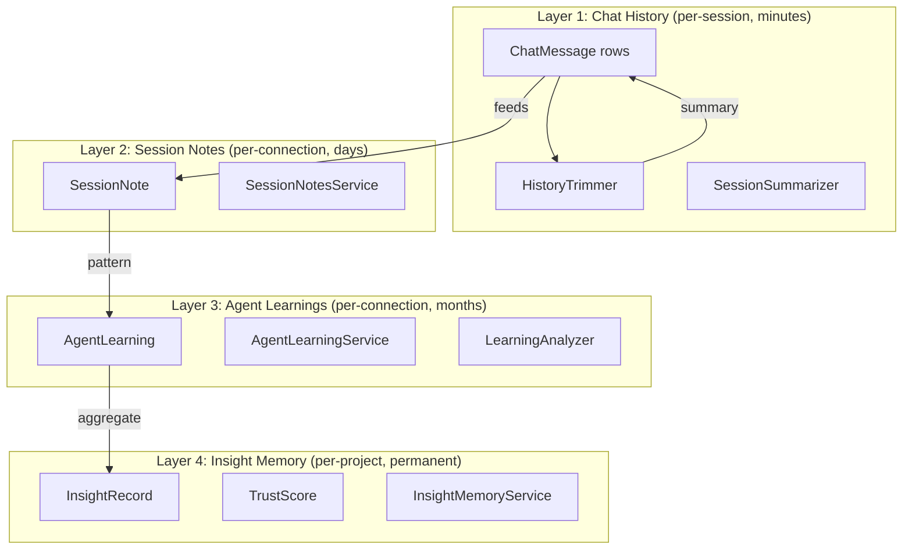

### 3.1 Layer 1: Chat History (Short-Term Memory)

**Scope**: Per chat session. **Lifetime**: Duration of conversation.

**Models** (`backend/app/models/chat_session.py`):
- `ChatSession`: project_id, title, user_id, connection_id, created_at
- `ChatMessage`: session_id, role (user/assistant/tool), content, metadata_json, tool_calls_json, user_rating

**ChatService** (`backend/app/services/chat_service.py`):
- `create_session()`, `add_message()`, `get_history_as_messages()`
- `get_history_as_messages()` enriches assistant messages with SQL context: appends query text, viz type, row count, column names, and sample data to the message content so the LLM has full context for follow-up questions.

**HistoryTrimmer** (`backend/app/core/history_trimmer.py`):

Manages two levels of trimming:

1. **Session-level trimming** (`trim_history()`): Before the orchestrator loop starts
   - Condenses tool results longer than 500 chars to 8-line previews
   - Walks backwards from newest message, accumulating tokens
   - When budget is exceeded, summarizes older messages via an LLM call into a single system message: `"[Conversation summary of N earlier messages] ..."`
   - If no LLM router available, uses fallback: `"Previous topics discussed: ..."`

2. **In-loop trimming** (`trim_loop_messages()`): During the tool-calling loop
   - Triggers at 80% of context budget
   - Preserves system prompt and last user message
   - Collapses intermediate assistant+tool pairs into one-liner summaries
   - Injects a "wrap up" instruction at 70% capacity to tell the LLM to stop making tool calls

**Token estimation**: Uses tiktoken when available (accurate for OpenAI models), falls back to character-based heuristic at ~4 chars per token.

### 3.2 Layer 2: Session Notes (Working Memory)

**Scope**: Per database connection, cross-session. **Lifetime**: Days to months (confidence decay).

Session notes are the agent's "working memory" — observations, conventions, and user preferences that persist across chat sessions for the same database connection.

**Model** (`backend/app/models/session_note.py`):

| Field | Description |
|-------|-------------|
| `connection_id` | Links to a specific database connection |
| `project_id` | Project scope |
| `category` | One of: `data_observation`, `column_mapping`, `business_logic`, `calculation_note`, `user_preference`, `verified_benchmark` |
| `subject` | Table or metric name |
| `note` | Free-text observation |
| `note_hash` | SHA-256 for exact dedup |
| `confidence` | 0.0 to 1.0 |
| `is_verified` | User-confirmed flag |
| `is_active` | Soft-delete flag |

**SessionNotesService** (`backend/app/services/session_notes_service.py`):

- **Fuzzy deduplication**: Before creating a note, checks existing notes with the same connection/category/subject. Uses `SequenceMatcher` with threshold 0.75 — if a similar note exists, its confidence is bumped (+0.1) and the longer text is kept.
- **Prompt compilation** (`compile_notes_prompt()`): Formats notes into a structured prompt block organized by category:
  ```
  AGENT NOTES (observations from previous sessions with this database):
  ### Business Logic
  - [orders] Cancelled orders are excluded from revenue. (85% [VERIFIED])
  ### Data Observations
  - [payments] Amounts stored in cents, divide by 100. (70%)
  ```
- **Confidence decay**: Unverified notes inactive for 60+ days lose 0.1 confidence per decay cycle. Notes below 0.1 are not included in prompts.
- Notes are injected into SQL agent prompts for context about the specific database.

### 3.3 Layer 3: Agent Learnings (Long-Term Memory)

**Scope**: Per database connection, cross-session. **Lifetime**: Months (with decay).

Agent learnings are structured lessons extracted from query validation outcomes and user feedback. They represent patterns the system has discovered about a specific database.

**Models** (`backend/app/models/agent_learning.py`):

- `AgentLearning`: connection_id, category, subject, lesson, lesson_hash, confidence, source_query, source_error, times_confirmed, times_applied, is_active
- `AgentLearningSummary`: connection_id, total_lessons, lessons_by_category_json, compiled_prompt, last_compiled_at

**Categories**:

| Category | Example |
|----------|---------|
| `table_preference` | "Use `transactions` instead of `legacy_payments` for revenue queries" |
| `column_usage` | "Column `user_name` does not exist on `users`. Use `full_name` instead" |
| `data_format` | "Column `amount` on `orders` stores values in cents. Divide by 100 for dollars" |
| `query_pattern` | "User flagged incorrect results for query on orders. Detail: missing date filter" |
| `schema_gotcha` | "Table `users` uses soft-delete. Always filter with `WHERE deleted_at IS NULL`" |
| `performance_hint` | "Table `events` can timeout on unfiltered queries. Always add LIMIT and date filter" |

**AgentLearningService** (`backend/app/services/agent_learning_service.py`):

- **Three-level deduplication**:
  1. Exact hash match (same lesson_hash + connection + category + subject)
  2. Fuzzy match (SequenceMatcher threshold 0.75)
  3. If duplicate found: bump confidence +0.1, keep longer lesson text

- **Conflict resolution**: When creating a new learning, checks existing ones for contradictions. Detects negation flips ("use" vs "not use", "always" vs "never", "avoid" vs "prefer"). If the new lesson has higher confidence, the old conflicting one is deactivated.

- **Confidence lifecycle**:
  ```
  Create: 0.6 (default)
    ↓ confirmed by user or repeated: +0.1 (cap at 1.0)
    ↓ applied in query: tracked (times_applied counter)
    ↓ contradicted: -0.3
    ↓ stale (30+ days): -0.02/month
    ↓ below 0.2: deactivated
  ```

- **Prompt compilation** (`compile_prompt()`): Priority-ranked by composite score (confidence * 0.4 + log(confirmations) * 0.4 + log(applications) * 0.2). Top 30 learnings organized by category, with confidence percentages and critical flags (5+ confirmations).

- **Cross-connection transfer**: Learnings from sibling connections in the same project are included if they are in transferable categories (`schema_gotcha`, `performance_hint`) and have confidence >= 0.6.

- **Global pattern promotion**: Learnings that appear independently on 2+ different connections are identified as "global patterns" and promoted to connections that don't have them yet. This allows knowledge to spread across databases.

- **How learnings are used**: The orchestrator loads the top 15 high-confidence learnings via `_load_recent_learnings()` and injects them into the system prompt under "RECENT AGENT LEARNINGS (verified insights)".

### 3.4 Layer 4: Insight Memory (Persistent Findings)

**Scope**: Per project, cross-connection. **Lifetime**: Permanent until resolved/dismissed.

Insights are higher-level findings discovered during data analysis — anomalies, trends, opportunities, data quality issues.

**Models** (`backend/app/models/insight_record.py`):

- `InsightRecord`: project_id, connection_id, insight_type, severity, title, description, evidence_json, source_metrics_json, source_query, recommended_action, expected_impact, confidence, status, user_verdict, user_feedback, times_surfaced, times_confirmed, times_dismissed
- `TrustScore`: insight_id, confidence, data_freshness_hours, sources_json, validation_method, sample_size

**Insight types**: `anomaly`, `opportunity`, `loss`, `trend`, `pattern`, `reconciliation_mismatch`, `data_quality`, `observation`

**Severity levels**: `critical`, `warning`, `info`, `positive`

**Status lifecycle**:
```
active → confirmed (user verified)
       → dismissed (user rejected)
       → resolved (user marked as fixed)
       → expired (confidence decayed below 0.15)
       → superseded (newer insight replaced it)
```

**InsightMemoryService** (`backend/app/core/insight_memory.py`):

- **Deduplication**: Before storing, checks existing active insights with similarity threshold 0.80 (SequenceMatcher on titles). If duplicate found: bumps `times_surfaced` and slightly increases confidence (+0.05).
- **Trust scoring**: Each insight has an associated `TrustScore` tracking data freshness, source list, validation method, and sample size.
- **Confidence decay**: Unconfirmed insights older than 30 days lose 0.05 confidence per decay cycle. Below 0.15 they are expired.
- **User feedback**: Users can confirm, dismiss, or resolve insights through the UI.

### 3.5 Context Budget Management

`ContextBudgetManager` (`backend/app/core/context_budget.py`) ensures all context fits within the model's context window.

**Allocation algorithm**:

```
total_budget = min(settings.max_context_tokens, model_context_window)

1. System prompt: exact fit (never truncated)
2. Chat history: min(remaining, 30% of total)
3. Schema / table map: min(remaining, 25% of total) → truncated if needed
4. Custom rules: min(remaining, 10% of total) → truncated if needed
5. Agent learnings: min(remaining, 8% of total) → truncated if needed
6. Project overview: whatever remains → truncated if needed
```

Truncation appends `"... (truncated to fit context budget)"` so the LLM knows information was cut.

---

## 4. LLM Integration and OpenRouter

### 4.1 Provider Abstraction

All LLM providers implement the `BaseLLMProvider` interface (`backend/app/llm/base.py`):

```python
class BaseLLMProvider(ABC):
    async def complete(messages, tools, model, temperature, max_tokens) -> LLMResponse
    def stream(messages, tools, model, temperature, max_tokens) -> AsyncIterator[str]
    def provider_name -> str
```

**Core data types**:
- `Message`: role (system/user/assistant/tool), content, optional tool_call_id, name, tool_calls
- `Tool`: name, description, list of `ToolParameter` (name, type, description, required, enum)
- `ToolCall`: id, name, arguments dict
- `LLMResponse`: content, tool_calls, usage dict, model, provider, finish_reason

### 4.2 Provider Adapters

| Adapter | File | SDK / Transport | Default Model | Timeout |
|---------|------|----------------|---------------|---------|
| `OpenAIAdapter` | `backend/app/llm/openai_adapter.py` | OpenAI Python SDK | `gpt-4o` | 90s |
| `AnthropicAdapter` | `backend/app/llm/anthropic_adapter.py` | Anthropic Python SDK | `claude-sonnet-4-20250514` | 90s |
| `OpenRouterAdapter` | `backend/app/llm/openrouter_adapter.py` | httpx (raw HTTP) | `openai/gpt-4o` | 120s |

The **OpenRouter adapter** communicates directly via HTTP to `https://openrouter.ai/api/v1`:
- Sets `HTTP-Referer: https://checkmydata.ai` and `X-Title: CheckMyData.ai` headers (required by OpenRouter)
- Supports both `complete()` (single response) and `stream()` (SSE streaming)
- Maps httpx errors to the unified error hierarchy: 429 → `LLMRateLimitError`, 401/403 → `LLMAuthError`, 400 with "context length" → `LLMTokenLimitError`, 5xx → `LLMServerError`, timeout → `LLMTimeoutError`

### 4.3 Unified Error Hierarchy

All provider-specific exceptions are caught in adapters and re-raised as unified types (`backend/app/llm/errors.py`):

```
LLMError (base)
├── LLMRateLimitError       retryable=True   retry_after=5s   (429)
├── LLMServerError          retryable=True   retry_after=2s   (5xx)
├── LLMTimeoutError         retryable=True   retry_after=2s
├── LLMConnectionError      retryable=True   retry_after=2s
├── LLMAuthError            retryable=False                   (401/403)
├── LLMTokenLimitError      retryable=False                   (context overflow)
├── LLMContentFilterError   retryable=False                   (policy violation)
└── LLMAllProvidersFailedError  retryable=True  retry_after=3s
```

Each error type has a `user_message` property with a human-friendly explanation.

### 4.4 LLMRouter — Retry + Fallback

`LLMRouter` (`backend/app/llm/router.py`) is the single entry point for all LLM calls. It provides:

**Provider registry**:
```python
PROVIDER_REGISTRY = {
    "openai": OpenAIAdapter,
    "anthropic": AnthropicAdapter,
    "openrouter": OpenRouterAdapter,
}
```

Providers are lazily instantiated on first use.

**Fallback chain construction** (`_get_fallback_chain()`):
1. Start with `preferred_provider` (request-level) or `settings.default_llm_provider` (app-level)
2. Append remaining providers in order: openai → anthropic → openrouter
3. Filter out providers with no API key configured
4. Filter out providers marked unhealthy (quarantined for 120 seconds)
5. If all filtered out (all unhealthy), fall back to all providers with keys

**Per-provider retry** (`_call_with_retry()`):
- Up to 3 attempts per provider
- Exponential backoff: 2s base, 2x multiplier
- Non-retryable errors (`LLMAuthError`, `LLMTokenLimitError`) fail immediately
- Retryable errors use `retry_after` from the error or the backoff delay

**Cross-provider fallback** (`complete()`):
```
for each provider in fallback_chain:
    try:
        return _call_with_retry(provider, messages, tools, model, ...)
    except LLMAuthError:
        break  # don't try other providers for auth errors
    except LLMTokenLimitError:
        continue  # try next provider (might have bigger context)
    except retryable error:
        mark_unhealthy(provider)
        continue  # try next provider

raise LLMAllProvidersFailedError
```

**Streaming fallback** (`stream()`):
- Same fallback chain logic
- Key constraint: if tokens have already been yielded to the client, the stream cannot be safely retried on another provider (partial response already sent)

**Health check loop**:
- Background task pings unhealthy providers every 60 seconds with a minimal "hi" message
- If a provider responds successfully, it's marked healthy and re-enters the fallback chain
- Started during app lifespan, stopped on shutdown

**Context window awareness**:

```python
MODEL_CONTEXT_WINDOWS = {
    "gpt-4o": 128_000,
    "gpt-4o-mini": 128_000,
    "gpt-4-turbo": 128_000,
    "gpt-4": 8_192,
    "gpt-3.5-turbo": 16_385,
    "claude-sonnet-4-20250514": 200_000,
    "claude-3-5-sonnet-20241022": 200_000,
    "claude-3-haiku-20240307": 200_000,
    "claude-3-opus-20240229": 200_000,
}
```

`get_context_window(model)` returns the known size or 16,000 as safe default. Also tries partial matching (e.g., "gpt-4o" matches "gpt-4o-mini").

### 4.5 Model Selection

Model selection happens at three levels:

**1. Project-level defaults** (`backend/app/models/project.py`):

Each project stores per-purpose LLM preferences:
- `agent_llm_provider` / `agent_llm_model` — for the orchestrator
- `sql_llm_provider` / `sql_llm_model` — for SQL generation
- `indexing_llm_provider` / `indexing_llm_model` — for repo indexing

**2. Request-level override**:

The chat request body can include `preferred_provider` and `model` fields that override project defaults. The resolution logic in the chat route:

```python
agent_provider = body.preferred_provider or project.agent_llm_provider
agent_model = body.model or project.agent_llm_model
sql_provider = project.sql_llm_provider or agent_provider
sql_model = project.sql_llm_model or agent_model
```

**3. Models API** (`backend/app/api/routes/models.py`):

`GET /api/models?provider=openrouter` returns available models. For OpenRouter, it fetches the live model list from `https://openrouter.ai/api/v1/models` with a double-checked locking cache (TTL: `model_cache_ttl_seconds`, default 3600s). For OpenAI and Anthropic, returns static model lists.

**Cost estimation**: The chat route's `_estimate_cost()` function uses cached OpenRouter pricing data to calculate USD cost per request: `prompt_tokens * prompt_price + completion_tokens * completion_price`.

**Frontend model picker**: `LlmModelSelector` component (`frontend/src/components/ui/LlmModelSelector.tsx`) shows a provider dropdown (openai / anthropic / openrouter) and a model dropdown that loads models via `api.models.list(provider)`.

---

## 5. Self-Learning and Feedback Loops

The system implements three interconnected feedback cycles that allow it to improve over time without explicit retraining.

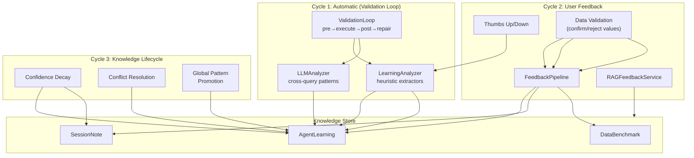

### 5.1 Cycle 1: Validation Loop Learning (Automatic)

This cycle requires zero user effort. Every time the SQL agent generates and executes a query, the system analyzes the attempt history and extracts lessons.

**ValidationLoop** (`backend/app/core/validation_loop.py`):

The SQL execution cycle:
1. **Pre-validation** (`PreValidator`): Schema checks — tables exist, columns exist, types compatible
2. **Safety check** (`SafetyGuard`): Read-only enforcement, DML blocking when configured
3. **Explain validation** (`ExplainValidator`): Warns on full table scans above row threshold
4. **Execution**: Runs the query against the user's database
5. **Post-validation** (`PostValidator`): Result sanity checks
6. **Error classification** (`ErrorClassifier`): Categorizes failures (table_not_found, column_not_found, syntax_error, timeout, permission_denied)
7. **Context enrichment** (`ContextEnricher`): Gathers additional schema info after failures
8. **Query repair** (`QueryRepairer`): LLM-based query fix using error context
9. **Retry**: Up to `max_retries` attempts with the repaired query

**LearningAnalyzer** (`backend/app/knowledge/learning_analyzer.py`):

After the validation loop completes, heuristic extractors analyze the sequence of query attempts:

| Extractor | Detects | Example |
|-----------|---------|---------|
| `_detect_table_preference` | Wrong table A in attempt N, fixed to table B in attempt N+1 | "Use `transactions` instead of `legacy_payments`" |
| `_detect_column_correction` | `column_not_found` error resolved by using a different column | "Column `user_name` doesn't exist on `users`. Use `full_name`" |
| `_detect_format_discovery` | Division by 100/1000 added in fix, or `::text` cast added | "Column `amount` on `orders` stores values in cents" |
| `_detect_schema_gotcha` | Soft-delete filter added (`deleted_at IS NULL`), or schema prefix added | "Table `users` uses soft-delete pattern" |
| `_detect_performance_hint` | Timeout resolved by adding LIMIT or date filter | "Table `events` can timeout on unfiltered queries" |

Each extracted lesson is checked against code-DB sync warnings to avoid duplicate learnings that the sync system already provides.

**LLMAnalyzer** (`backend/app/knowledge/learning_analyzer.py`):

For deeper pattern extraction (e.g., multi-query anti-patterns), the system can trigger an LLM-based analysis:
- Runs only when there are 3+ query attempts in a session
- Rate-limited to max once per hour per connection (`COOLDOWN_SECONDS = 3600`)
- LLM receives the full attempt history and outputs structured JSON lessons
- Lessons are validated (category must be valid, confidence clamped to 0.5-0.9) before storage

### 5.2 Cycle 2: User Feedback Pipeline (Explicit)

Users provide feedback through two mechanisms:

**Thumbs up/down** (`POST /api/chat/feedback`):
- Thumbs up: positive reinforcement (stored as user_rating on the message)
- Thumbs down: triggers `LearningAnalyzer.analyze_negative_feedback()` which creates a `query_pattern` learning with the user's error description

**Data validation** (via `FeedbackPipeline` in `backend/app/services/feedback_pipeline.py`):

When the user provides expected values for a query result, a `DataValidationFeedback` record is created with a verdict:

| Verdict | Pipeline Action |
|---------|----------------|
| **confirmed** | Store as benchmark → `BenchmarkService.create_or_confirm()` |
| **approximate** | Store benchmark + create session note with deviation details |
| **rejected** | Create learning (categorized by rejection reason) + session note + flag existing benchmark as stale |

**Rejection categorization**: The `_derive_learning()` function classifies the rejection reason:
- Currency/format keywords → `data_format` category
- Filter/where/status keywords → `schema_gotcha` category
- Table/legacy keywords → `table_preference` category
- Join/relationship keywords → `schema_gotcha` category
- Anything else → generic `schema_gotcha`

**RAG feedback** (`backend/app/services/rag_feedback_service.py`):

After every chat response that used RAG, the system records which chunks were retrieved and whether the query succeeded. This creates a quality signal for each chunk:
- `RAGFeedback`: project_id, chunk_id, source_path, doc_type, distance, query_succeeded, question_snippet, commit_sha
- Used to improve retrieval quality over time

### 5.3 Cycle 3: Confidence Decay and Knowledge Lifecycle

The system implements a biological-inspired knowledge decay model:

**Agent Learning decay** (`AgentLearningService.decay_stale_learnings()`):
- Triggered periodically (recommended: daily)
- Learnings not updated in 30+ days: confidence -= 0.02
- Below 0.2 confidence: deactivated (soft-deleted)
- Result: unused knowledge gradually fades, frequently-confirmed knowledge persists

**Session Note decay** (`SessionNotesService.decay_stale_notes()`):
- Unverified notes inactive for 60+ days: confidence -= 0.1
- Floor at 0.1 confidence
- User-verified notes are exempt from decay

**Insight decay** (`InsightMemoryService.decay_stale_insights()`):
- Unconfirmed insights older than 30 days: confidence -= 0.05
- Below 0.15: status changed to "expired"

**Conflict resolution** in `AgentLearningService._resolve_conflicts()`:
- When a new learning is created, checks existing ones with the same subject
- Detects "negation flips" (e.g., old: "use table A", new: "never use table A")
- If the new learning has higher confidence, the old conflicting one is deactivated
- This ensures the system doesn't accumulate contradictory advice

**Global pattern promotion** in `AgentLearningService.promote_global_patterns()`:
- Scans all learnings across all connections
- Learnings that appear on 2+ independent connections are identified as universal patterns
- These patterns are promoted to connections that don't have them yet (up to 5 per prompt)
- Format: `"[global pattern, seen on N DBs] lesson text [confidence%]"`

---

## 6. User Interaction Flow

### 6.1 Chat Flow (HTTP + SSE)

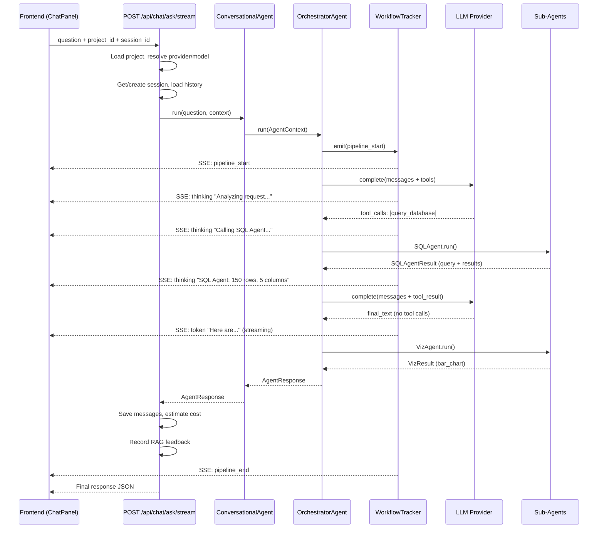

**WorkflowTracker** (`backend/app/core/workflow_tracker.py`):

The in-memory event bus that powers real-time progress reporting:
- Maintains a list of `asyncio.Queue` subscribers
- Each SSE connection subscribes a queue
- Events are `WorkflowEvent` dataclasses with: workflow_id, step, status, detail, elapsed_ms, timestamp, pipeline, extra
- Events are broadcast to all subscribers matching the workflow_id

**Key event types**:

| Step | Status | When |
|------|--------|------|
| `pipeline_start` | `started` | Request begins |
| `thinking` | `in_progress` | Orchestrator reasoning steps |
| `orchestrator:llm_call` | `in_progress` | LLM call started |
| `orchestrator:sql_agent` | `in_progress` | SQL sub-agent invoked |
| `orchestrator:knowledge_agent` | `in_progress` | Knowledge search invoked |
| `token` | `streaming` | Final answer text chunks |
| `pipeline_end` | `completed` | Request finished |
| `orchestrator:llm_retry` | `retrying` | Provider error, retrying |
| `orchestrator:warning` | `degraded` | Graceful degradation notice |

**Session management**:
- Sessions are auto-created when a user sends the first message to a project
- Title is generated from the first user question
- Session rotation: when message count exceeds a threshold, a new session is started with an LLM-generated summary of the previous conversation

### 6.2 Pipeline Interaction (Multi-Stage)

For complex queries that trigger the multi-stage pipeline:

**Response types and their meaning**:

| `response_type` | Meaning | User Action |
|-----------------|---------|-------------|
| `text` | Plain conversational answer | None |
| `sql_result` | Query + results + visualization | View data, provide feedback |
| `knowledge` | RAG-based answer with sources | View sources |
| `clarification_request` | Agent needs more info | Answer the question |
| `stage_checkpoint` | Intermediate pipeline result | Continue / Modify / Retry |
| `stage_failed` | Pipeline stage failed validation | Retry / Modify |
| `pipeline_complete` | All stages finished successfully | View combined results |
| `error` | Unrecoverable error | Retry or rephrase |

**Pipeline resume flow**:

When the user responds to a checkpoint or failure:
1. Frontend sends a message with `pipeline_action` ("continue"/"modify"/"retry") and `pipeline_run_id` in the extras
2. Orchestrator detects the pipeline action in `_check_pipeline_resume()`
3. `_resume_pipeline()` loads the `PipelineRun` from DB, reconstructs `StageContext`
4. For "continue": starts from next stage
5. For "retry": re-executes the current stage
6. For "modify": re-executes with user's modification as feedback

### 6.3 Frontend State Management

**Zustand stores** (`frontend/src/stores/`):

| Store | Purpose |
|-------|---------|
| `app-store` | Active project, session, connection, sidebar state |
| `auth-store` | JWT tokens, user profile, login/logout |
| `log-store` | Workflow events for the activity log |
| `notes-store` | Session notes cache |
| `task-store` | Background task tracking (indexing, etc.) |
| `toast-store` | Notification toasts |

**State restoration** (`frontend/src/hooks/useRestoreState.ts`):
- On page load, restores `active_session_id` from localStorage
- Fetches messages for the restored session via `api.chat.getMessages()`
- Populates the chat panel with previous conversation

**SSE client** (`frontend/src/lib/sse.ts`):
- Establishes an EventSource connection to the streaming endpoint
- Parses `WorkflowEvent` JSON from each SSE event
- Updates the log store and triggers UI re-renders for thinking indicators, token streaming, and pipeline status

### 6.4 API Endpoints (Chat)

Key chat-related endpoints in `backend/app/api/routes/chat.py`:

| Method | Path | Purpose |
|--------|------|---------|
| `POST` | `/api/chat/sessions` | Create a new chat session |
| `GET` | `/api/chat/sessions` | List sessions for a project |
| `GET` | `/api/chat/sessions/{id}/messages` | Get messages for a session |
| `POST` | `/api/chat/ask` | Ask a question (synchronous) |
| `POST` | `/api/chat/ask/stream` | Ask a question (SSE streaming) |
| `POST` | `/api/chat/feedback` | Submit thumbs up/down |
| `POST` | `/api/chat/estimate` | Estimate cost before asking |
| `GET` | `/api/chat/search` | Search across chat history |
| `WS` | `/api/chat/ws/{project}/{connection}` | WebSocket for real-time chat |

---

## 7. Knowledge Layer (RAG)

### 7.1 Vector Store

`ChromaDB` is used as the vector store (`backend/app/knowledge/vector_store.py`):
- One collection per project
- Documents are chunked code/documentation with metadata (source_path, doc_type, entity_type)
- Similarity search returns ranked chunks for context injection

### 7.2 Repository Indexing Pipeline

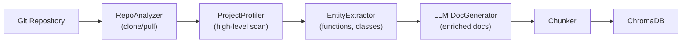

1. **Clone/Pull**: `RepoAnalyzer` manages the local copy of the Git repository
2. **Project profiling**: High-level scan to identify framework, language, structure
3. **Entity extraction**: Parses source files to extract functions, classes, methods
4. **LLM documentation generation**: Generates enriched documentation for each entity
5. **Chunking**: Splits documents into appropriately sized chunks
6. **Storage**: Stored in ChromaDB with embeddings for similarity search

### 7.3 Database Schema Indexing

`DbIndexService` builds the "table map" that gives the orchestrator and SQL agent knowledge of the database structure:
- Connects to the user's database and introspects schema
- Builds a compact representation: table names, columns, types, relationships
- Used as routing context in the orchestrator prompt and detailed context for the SQL agent

### 7.4 Code-DB Sync

Links ORM models found in the codebase to actual database tables:
- Identifies Prisma schemas, SQLAlchemy models, Django models, etc.
- Extracts `conversion_warnings` (e.g., "amounts stored in cents")
- These warnings are used to dedup against learning analyzer output

### 7.5 Custom Rules

`CustomRulesEngine` (`backend/app/knowledge/custom_rules.py`):
- Users can create project-specific rules via the UI or the `manage_rules` meta-tool
- Rules are markdown documents with guidelines about how to query the database
- Injected into SQL agent prompts for domain-specific knowledge

---

## 8. Data Flow Diagrams

### 8.1 Simple Query — End to End

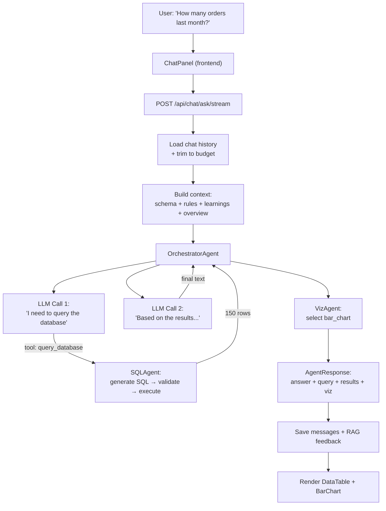

### 8.2 Complex Pipeline — Multi-Stage

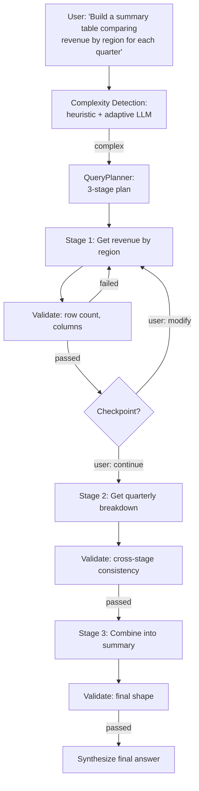

### 8.3 Memory Layer Interaction

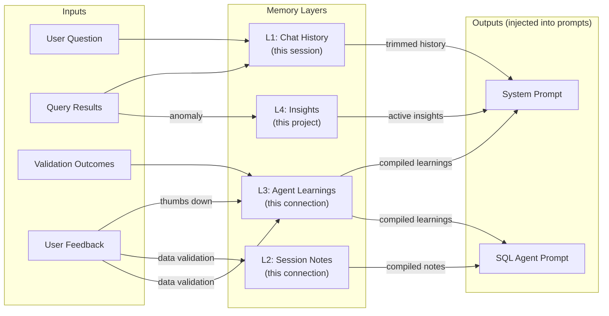

### 8.4 Feedback / Learning Cycle

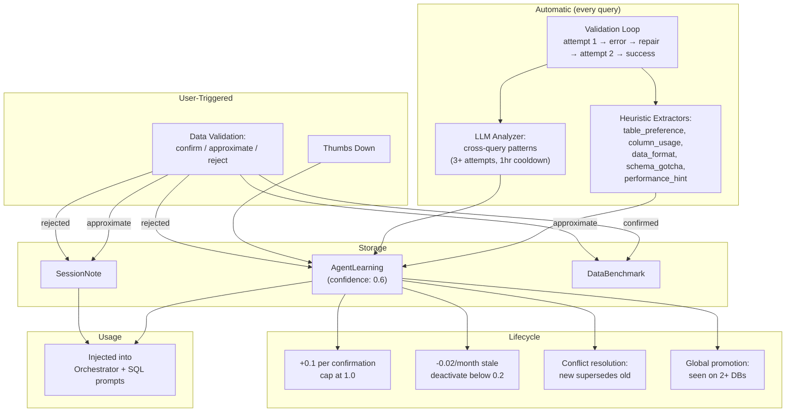

### 8.5 LLM Provider Fallback Chain

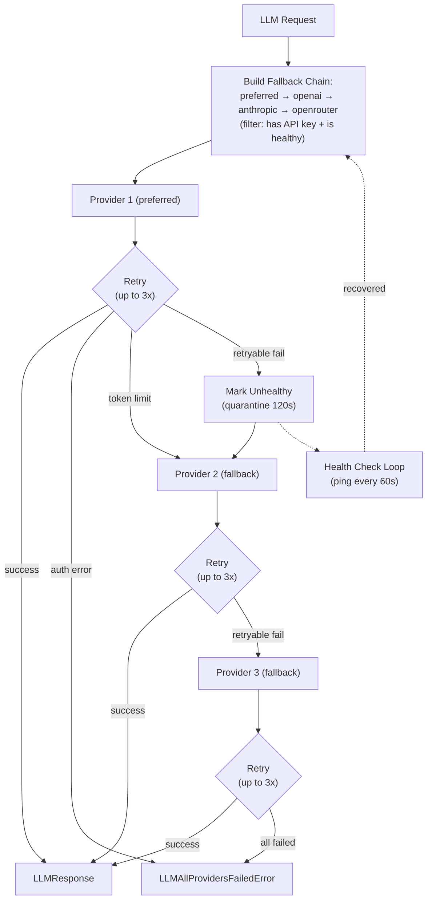

---

## Appendix: Configuration Reference

Key settings from `backend/app/config.py` that affect system behavior:

| Setting | Default | Description |
|---------|---------|-------------|
| `default_llm_provider` | `"openai"` | Primary LLM provider |
| `openai_api_key` | — | OpenAI API key |
| `anthropic_api_key` | — | Anthropic API key |
| `openrouter_api_key` | — | OpenRouter API key |
| `max_context_tokens` | varies | Maximum tokens for context window |
| `max_history_tokens` | varies | Maximum tokens for chat history |
| `max_orchestrator_iterations` | `25` | Tool-calling loop safety ceiling |
| `orchestrator_wrap_up_steps` | `3` | Steps remaining to trigger wrap-up prompt |
| `orchestrator_final_synthesis` | `true` | Enable LLM synthesis on step exhaustion |
| `max_investigation_iterations` | `12` | Investigation agent loop limit |
| `history_summary_model` | — | Model for history summarization |
| `model_cache_ttl_seconds` | `3600` | How long to cache OpenRouter model list |
| `max_pie_categories` | varies | Threshold for pie chart → bar chart fallback |
