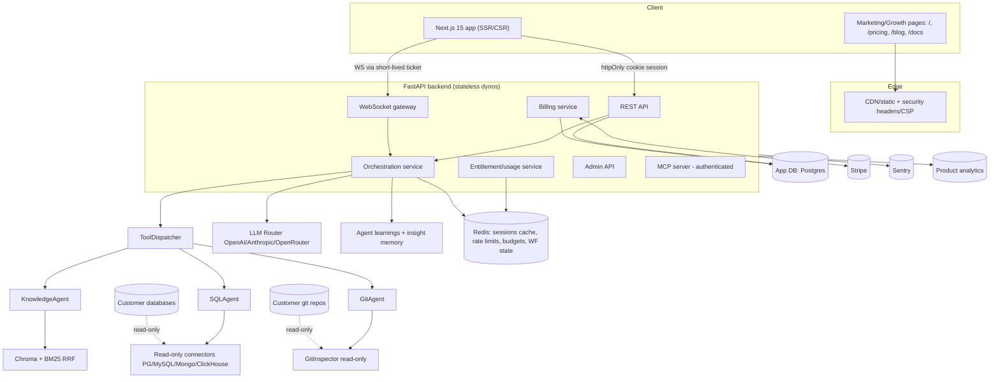

# 02 — Technical Specification (Target Architecture)

This document specifies the target architecture required to ship CheckMyData.ai as a
commercial SaaS. It describes components, backend and frontend logic, the application
database, the API surface, the admin panel, payments, analytics, security, scalability,
and monitoring — and it states the explicit deltas from the as-built system.

It is written so engineering can build against it and QA can verify against it. Each delta
references the backlog tasks (`T-*`) and audit findings (`F-*`) that drive it.

## 1. As-built vs target (executive delta)

| Area | As-built | Target | Drivers |
| --- | --- | --- | --- |
| Billing | None | Stripe Checkout + Portal + webhooks, plan/entitlement model | F-BIZ-1, T-BILL-* |
| Cost control | `check_budget` defined but never called | Enforced per-plan budgets in shared store | F-BIZ-2, F-FIN-1, T-BILL-6 |
| Session auth | JWT in localStorage + WS token in URL | httpOnly cookies + WS ticket/subprotocol | F-SEC-2/3, T-SEC-2/3 |
| MCP | Anonymous/hardcoded user | Authenticated principal + tenancy checks | F-SEC-1, T-SEC-1 |
| SSH host keys | Default `disabled` | Default `strict`/`tofu`, fail-closed | F-SEC-4, T-SEC-4 |
| State | Per-process in-memory | Externalized to Redis | F-ARCH-1, T-SCALE-1 |
| Rate limits | In-memory per-process | Redis shared limiter tied to entitlements | F-SEC-7, T-SEC-7 |
| Observability | Logs only | Sentry + structured audit logs + metrics | F-SEC-8, T-OBS-1/2 |
| MySQL fetch | `fetchall()` then cap | SQL `LIMIT` + chunked/server-side cursor | F-ARCH-5, T-ARCH-5 |
| CI gates | `--fail-under=40`, no E2E/load/SAST | Aligned coverage + E2E + load + SAST | F-QA-1/2/3/4, T-QA-* |
| Headers | No CSP/HSTS | Strict CSP/HSTS + security headers | F-SEC-6, T-SEC-6 |
| Admin | None | Role-gated admin console with audit log | F-OPS-1, T-ADMIN-* |

## 2. Target system architecture

Principle: backend dynos are **stateless**; all shared/ephemeral state lives in Redis or
the app DB. This is the precondition for horizontal scale (F-ARCH-1).

## 3. Backend logic

### 3.1 Orchestration
- Keep the multi-agent design (Orchestrator + SQL/Knowledge/Git/MCP agents, LLM router with
  fallback) but converge on **one canonical execution contract** (F-ARCH-3, `T-ARCH-3`):
  the "unified tool loop" is the single entry; the adaptive pipeline becomes a pluggable
  planning strategy invoked within that loop, sharing `ToolDispatcher` and tests.
- Decompose `api/routes/chat.py` (~2,811 lines) into transport (HTTP/WS), message
  validation, and an orchestration entry service (F-ARCH-2, `T-ARCH-1`). Decompose
  `orchestrator.py`/`sql_agent.py` along clear seams behind characterization tests
  (`T-ARCH-2`).
- Remove or quarantine deprecated `core/orchestrator.py` and `core/tool_executor.py`
  (F-ARCH-4, `T-ARCH-4`); guarantee no production import path uses them.

### 3.2 Connectors (read-only, safe by construction)
- All connectors remain read-only; `SafetyGuard` continues to enforce read-only SQL.
- **Result bounding (`T-ARCH-5`):** push `LIMIT` into SQL, use server-side/chunked cursors,
  and enforce both row and byte caps before materializing — fixes the MySQL `fetchall()`
  OOM path (F-ARCH-5). Apply uniformly across PG/MySQL/Mongo/ClickHouse.
- Connection pooling moves to a model safe for multiple stateless dynos (per-dyno bounded
  pools; no cross-request shared mutable connector state).
- SSH tunneling: default host-key policy `strict`/`tofu`, fail-closed (`T-SEC-4`);
  pre-commands disabled by default / allowlisted with no shell (`T-SEC-5`).

### 3.3 Entitlements & usage (new authority)
- A single **EntitlementService** answers "can this user/plan do X now?" (connection count,
  seat count, feature flags, remaining token/query budget).
- `usage_service.check_budget()` is **wired into the orchestrator/chat entry path**
  (`T-BILL-6`, closes F-BIZ-2) and backed by Redis counters (atomic increments) with the
  app DB as the period-of-record.
- Budget exhaustion returns a structured "limit reached" result the UI renders as a
  paywall (PRD §10.5), not a generic error.

### 3.4 Billing service (new)
- Integrates Stripe: create customer on signup, Checkout sessions for plan purchase/trial
  conversion, Customer Portal for self-serve management.
- **Webhook handler** is idempotent (dedupe on Stripe event id), verifies signatures, and
  is the single writer of subscription state. CSRF-exempt but signature-verified.
- Maps Stripe subscription/price → internal plan → entitlements.

### 3.5 MCP server
- Require an authenticated principal mapped to a real `user_id`; resolve `project_id`
  ownership/membership exactly like the HTTP API; remove anonymous/hardcoded `mcp-user`
  (F-SEC-1, `T-SEC-1`). Gate behind a feature flag, off by default until auth lands.

## 4. Frontend / mobile logic

- Next.js 15 App Router, React 19, Tailwind 4, Zustand. Mobile = responsive web at launch.
- **Session:** move from `localStorage` JWT to httpOnly Secure SameSite cookies; add CSRF
  tokens for state-changing requests (F-SEC-3, `T-SEC-3`). WebSocket auth via a short-lived
  ticket fetched over the authenticated API, never via URL query (F-SEC-2, `T-SEC-2`).
- **Route guards:** all app routes (incl. `/dashboard/[id]`) enforce auth server-side and
  client-side (F-UX-1, `T-UX-1`).
- **New routes/screens:** `/pricing`, `/settings/billing`, `/admin/*`, plus growth pages
  (`/blog`, `/docs`, comparison/alternative pages).
- **Component decomposition:** split oversized components (`ConnectionSelector.tsx` ~1,302,
  `ChatPanel.tsx` ~957, `Sidebar.tsx` ~924) into container/presentational units with tests
  (`T-ARCH-2`/frontend portion).
- **A11y/SEO:** per-route document titles/metadata, keyboard-navigable tooltips/cost
  estimator, focus traps in modals (F-UX-3, `T-UX-3`).
- Wire or remove `InsightFeedPanel.tsx`/`MetricCatalogPanel.tsx` (F-UX-2, `T-UX-2`).

## 5. Application database (target schema additions)

Existing: users, projects, project members, connections (encrypted creds), conversations/
messages, learnings/insight memory, etc. (SQLAlchemy 2.x + Alembic).

New tables (Alembic migrations, `T-BILL-1`):

| Table | Key fields | Purpose |
| --- | --- | --- |
| `plans` | id, name, price_id, limits (connections, seats, token_budget), features | Plan catalog mirroring Stripe prices |
| `subscriptions` | id, user_id/org_id, plan_id, stripe_customer_id, stripe_subscription_id, status, current_period_end, seats | Source of truth for entitlement |
| `invoices` | id, subscription_id, stripe_invoice_id, amount, status, period, url | Billing history surfaced in UI |
| `usage_counters` | id, scope (user/org), period, queries_used, tokens_used | Period-of-record for metering (Redis is the hot path) |
| `stripe_events` | stripe_event_id (unique), type, processed_at | Webhook idempotency |
| `entitlements` (or derived) | scope, feature, limit, value | Resolved access used by EntitlementService |
| `audit_log` | id, actor_id, action, target, metadata, created_at | Admin + security audit (T-OBS, T-ADMIN) |

Org/tenancy: if seats/teams are billed at the org level, introduce an `organizations`
concept (or reuse projects-as-tenant) — decided in Modules (M1/M9); **Needs validation**.

## 6. API surface (additions/changes)

- `POST /billing/checkout` — create a Checkout session for a plan/trial.
- `GET /billing/portal` — return a Customer Portal URL.
- `POST /billing/webhook` — Stripe webhook (signature-verified, idempotent).
- `GET /billing/subscription` — current plan, status, usage vs limits.
- `GET /usage` — current period usage meters.
- Entitlement enforcement middleware on protected actions (connect source, run query,
  invite member) returning structured `402 Payment Required`/`limit_reached` payloads.
- `WS /ws/{project}/{connection}` — auth via ticket/subprotocol, not query token.
- Admin API under `/admin/*` (role-gated, audited).
- MCP tools require authenticated principal + tenancy checks.

All endpoints: consistent error envelope, request IDs propagated to Sentry, PII scrubbed.

## 7. Admin panel

Role-gated `/admin` (see PRD §10.7): user/plan management, support impersonation (audited),
connection diagnostics (no plaintext creds), feature-flag control, and an audit log view.
Backed by `audit_log` and EntitlementService; never reachable by normal users.

## 8. Payments (Stripe) — design rules

- Stripe is the system of record for payment; our `subscriptions` table mirrors it via
  webhooks (never trust client-reported plan).
- Idempotent webhook processing keyed on `stripe_event_id` (`stripe_events` table) — no
  double-grant on retries.
- Signature verification on every webhook; endpoint CSRF-exempt but otherwise locked down.
- Entitlement changes are driven only by webhook-confirmed state; the UI may optimistically
  reflect a successful Checkout but reconciles against the backend.
- Trials handled via Stripe trial or internal trial flag (decide in `T-BILL-3`).

## 9. Analytics

- **Product analytics:** event taxonomy for signup, activation (first successful query),
  query run, paywall shown, checkout started/completed, upgrade, invite, churn signals.
  Implemented with a privacy-respecting provider; consent-aware.
- **Cost analytics:** per-user/plan LLM token spend (from the orchestrator/LLM router) fed
  into the cost guardrail and gross-margin dashboards (F-FIN-1).
- **Funnel dashboards** for the metrics in PRD §9.

## 10. Security architecture

- **Sessions:** httpOnly cookies + CSRF; short token lifetime + rotation.
- **Transport headers:** strict CSP, HSTS, `X-Content-Type-Options`, `Referrer-Policy`,
  frame-ancestors (F-SEC-6, `T-SEC-6`).
- **Secrets:** Fernet-encrypted connection creds (existing); ensure key management/rotation
  documented; never log secrets or tokens.
- **MCP & tenancy:** authenticated principal + ownership checks everywhere (`T-SEC-1`).
- **SSH:** strict host-key default, fail-closed; no shell pre-commands by default.
- **Rate limiting & abuse:** Redis-backed, tied to entitlements (`T-SEC-7`).
- **Supply chain:** SAST + dependency scanning in CI (`T-QA-4`).
- **Data minimization for LLMs:** define and document what schema/data is sent to LLMs,
  with redaction options for Enterprise (feeds DPA, F-LEGAL-1).

## 11. Scalability

- Stateless dynos + Redis for sessions/cache/rate-limits/budgets/workflow intermediate
  state (`_wf_sql_results` and connector/MCP caches move out of process) — F-ARCH-1,
  `T-SCALE-1`.
- WebSocket fan-out designed to not require sticky in-memory state (relay via Redis
  pub/sub if needed).
- Connection pooling bounded per dyno; result caps prevent single-query memory blowups.
- Background work (indexing, digests, maintenance decay) on a worker/queue (Redis-backed),
  not in the web process.
- Capacity validated by load tests with p50/p95 targets (`T-QA-3`).

## 12. Monitoring & logging

- **Error tracking:** Sentry (backend + frontend) with PII scrubbing and release tagging
  (F-SEC-8, `T-OBS-1`).
- **Structured logs:** JSON logs with request IDs; auth/connection/billing/admin events go
  to `audit_log`.
- **Metrics & alerts:** latency (p50/p95), query success rate, LLM spend, webhook failures,
  budget-exhaustion rate, error rate. Spend-anomaly alerting (`T-OBS-2`, F-FIN-1).
- **Dashboards:** reliability + cost + funnel, reviewed pre-release and in operations.

## 13. Deltas summary → backlog

Every delta in §1 is realized by tasks in `04-BACKLOG.md`. The P0 set (must land before any
paid/public launch) is: `T-SEC-1..4`, `T-SEC-6`, `T-ARCH-5`, `T-BILL-1..6`, `T-OBS-1`,
`T-UX-1`, `T-QA-1`. P1 hardening: `T-SCALE-1`, `T-SEC-7`, `T-ARCH-1..4/6`, `T-QA-2..5`,
`T-OBS-2`, `T-ADMIN-*`, `T-LEGAL-*`, `T-GROW-*`. See `05-ROADMAP.md` for phase placement.
