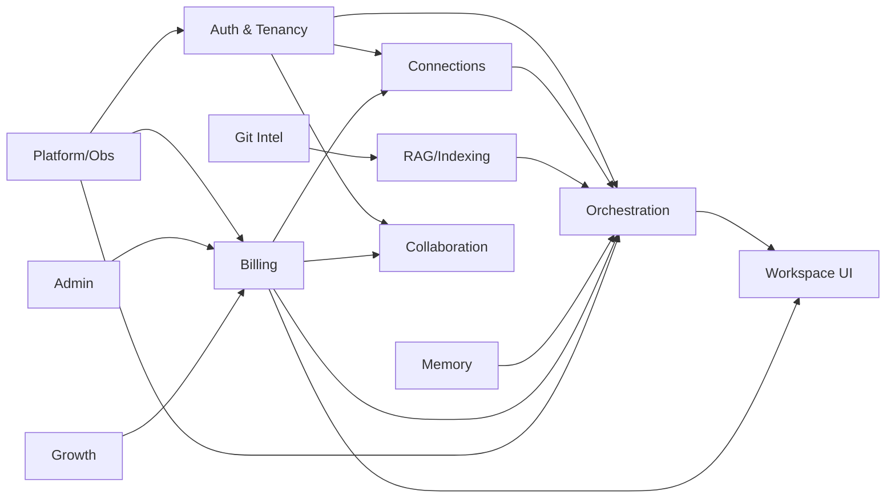

# 03 — Module Breakdown

The system is decomposed into 12 modules. For each module: its goal, key functions, user
scenarios, technical requirements, dependencies, risks, and readiness (Definition of Done)
criteria. Modules map to Linear epics (see `README.md`). New modules required for
commercial launch are marked **NEW**.

| # | Module | Status |
| --- | --- | --- |
| M1 | Auth & Tenancy | Exists, hardening required |
| M2 | Connections & Secrets | Exists, hardening required |
| M3 | Agent Orchestration | Exists, refactor required |
| M4 | Knowledge / RAG & Indexing | Exists, productionize |
| M5 | Git Intelligence | Exists |
| M6 | Memory & Learning | Exists |
| M7 | Viz, Dashboards & Workspace UI | Exists, gaps |
| M8 | Collaboration & Sharing | Partial |
| M9 | Billing & Monetization | **NEW** |
| M10 | Admin & Ops Console | **NEW** |
| M11 | Observability, Cost Control & Platform | Partial |
| M12 | Marketing, SEO & Growth | **NEW** |

---

## M1 — Auth & Tenancy
**Goal:** Authenticate users securely and ensure every action is scoped to a tenant the
user is authorized for.

**Key functions:** signup/login (email + Google OAuth), session management, project
membership/roles, access checks on all resources, MCP principal auth.

**User scenarios:** S-1 (signup), S-5 (team membership), all protected actions.

**Technical requirements:**
- httpOnly Secure SameSite cookie sessions + CSRF (replaces localStorage JWT) — `T-SEC-3`.
- WebSocket auth via short-lived ticket/subprotocol, not URL token — `T-SEC-2`.
- MCP authenticated principal + tenancy checks; remove anonymous/`mcp-user` — `T-SEC-1`.
- Consistent ownership/membership checks across HTTP, WS, and MCP.
- Security headers (CSP/HSTS) at the app edge — `T-SEC-6`.

**Dependencies:** Redis sessions (M11/`T-SCALE-1`) for revocation/rotation at scale.

**Risks:** session migration breaking existing clients (Needs validation §7);
cookie/CSRF interplay with SSE/WebSocket.

**Readiness (DoD):** no token in URL or localStorage; MCP rejects unauthenticated/
cross-tenant calls (test-proven); CSP/HSTS present; auth covered by E2E (`T-QA-2`).

---

## M2 — Connections & Secrets
**Goal:** Let users connect read-only data sources safely, with encrypted credentials and
hardened tunneling.

**Key functions:** add/edit/test connections (PG/MySQL/Mongo/ClickHouse), Fernet-encrypted
credential storage, optional SSH tunnel, bounded result fetching, connection diagnostics.

**User scenarios:** S-1, S-2, S-3; connection-at-limit → paywall (S-4).

**Technical requirements:**
- SSH host-key policy default `strict`/`tofu`, fail-closed — `T-SEC-4`.
- SSH pre-commands disabled/allowlisted, no shell — `T-SEC-5`.
- Result bounding: SQL `LIMIT` + server-side/chunked cursor + row & byte caps across all
  connectors (fixes MySQL `fetchall()` OOM) — `T-ARCH-5`.
- Connection-count entitlement check before creating a connection (M9).
- Per-dyno bounded pools; no shared mutable connector state across dynos.

**Dependencies:** Encryption service (existing), EntitlementService (M9), Redis (M11).

**Risks:** host-key strictness causing connection friction (mitigate with clear TOFU UX);
driver-specific cursor behavior.

**Readiness (DoD):** large result cannot OOM a dyno (load-tested); secure SSH default
shipped + documented; connection creation respects plan limits; test-connection has clear
success/failure states.

---

## M3 — Agent Orchestration
**Goal:** Plan and execute multi-agent work reliably with one canonical execution contract.

**Key functions:** routing, planning (adaptive pipeline as a strategy), unified tool loop,
tool dispatch, LLM routing/fallback, iteration/time ceilings.

**User scenarios:** S-2, S-3 (core query loop and code+data investigations).

**Technical requirements:**
- Converge dual paths to one contract; pipeline becomes a planning strategy within the
  unified loop sharing `ToolDispatcher` and tests — `T-ARCH-3`.
- Decompose `api/routes/chat.py` into transport/validation/orchestration entry — `T-ARCH-1`.
- Decompose `orchestrator.py`/`sql_agent.py` behind characterization tests — `T-ARCH-2`.
- Remove/quarantine deprecated `core/orchestrator.py` + `core/tool_executor.py` — `T-ARCH-4`.
- Enforce budget check at entry (M9/`T-BILL-6`).

**Dependencies:** EntitlementService (M9), Redis for workflow state (M11), connectors (M2),
RAG (M4), Git (M5), memory (M6).

**Risks:** refactor regressions (mitigate: characterization tests first); behavioral drift
during convergence.

**Readiness (DoD):** single documented execution path; no production import of deprecated
modules; god-files reduced and unit-testable; orchestration covered by integration tests;
budget enforced at entry.

---

## M4 — Knowledge / RAG & Indexing
**Goal:** Retrieve the right schema and code context to ground answers.

**Key functions:** Chroma vector store + BM25 with RRF, AST-based code intelligence,
question-aware schema retrieval, code↔DB lineage, functional clustering, index lifecycle.

**User scenarios:** S-2, S-3.

**Technical requirements:**
- Decide default-on vs experimental per feature (`hybrid_retrieval_enabled`,
  `schema_retrieval_enabled`, `code_graph_enabled`, `lineage_enabled`) with benchmarks;
  align docs to defaults — `T-ARCH-6`.
- Indexing runs on a background worker/queue, not the web process (M11).
- Index storage durable and shared (not per-dyno ephemeral).

**Dependencies:** Git Intelligence (M5), connectors (M2), platform/worker (M11).

**Risks:** index freshness vs cost; embedding model download/caching at scale (CI already
caches HF models).

**Readiness (DoD):** retrieval features have explicit on/off defaults matching docs,
benchmarked for quality/latency; indexing does not block web requests; retrieval covered by
tests.

---

## M5 — Git Intelligence
**Goal:** Provide safe, read-only repository understanding to answer code+data questions.

**Key functions:** read-only Git clone/inspection with path-traversal guards and output
caps, AST parsing feeding the code knowledge graph, code↔DB lineage.

**User scenarios:** S-3.

**Technical requirements:**
- Maintain read-only invariant and security guards (no hook execution, output caps).
- SSH key handling consistent with M2 host-key policy.
- Repo size/time limits to protect platform resources.

**Dependencies:** RAG/indexing (M4), connections/secrets (M2).

**Risks:** large/slow repos; credential handling for private repos.

**Readiness (DoD):** read-only guarantees test-proven; resource caps enforced; lineage
results usable in answers.

---

## M6 — Memory & Learning
**Goal:** Improve accuracy and speed over time via project-scoped learnings and insights.

**Key functions:** agent learning service, insight memory, decay/maintenance cadence,
surfacing "what I've learned" to users.

**User scenarios:** retention (§6), S-2/S-3 improving with use.

**Technical requirements:**
- Storage durable and tenant-scoped; learnings shared within a project/team (M8).
- Maintenance/decay runs on a worker, not web process (M11).
- Define data-retention semantics for stored learnings/insights (feeds DPA, F-LEGAL-1).

**Dependencies:** orchestration (M3), platform/worker (M11), legal/retention (M11/M9).

**Risks:** stored customer-derived data raising compliance scope; memory staleness.

**Readiness (DoD):** learnings improve measured query success/latency; retention policy
documented and enforced; tenant isolation verified.

---

## M7 — Viz, Dashboards & Workspace UI
**Goal:** Deliver the core workspace experience and saved visualizations with correct
states and accessibility.

**Key functions:** chat workspace, answer anatomy (SQL/results/chart/context), connections
UI, dashboards (`/dashboard/[id]`), history, project memory UI, insight feed.

**User scenarios:** S-1, S-2, S-3; all empty/error/limit states (PRD §10).

**Technical requirements:**
- Auth-gate `/dashboard/[id]` and all app routes — `T-UX-1`.
- Decompose oversized components (`ConnectionSelector`, `ChatPanel`, `Sidebar`) — `T-ARCH-2`
  (frontend portion).
- Per-route titles/metadata + keyboard/focus a11y (tooltips, cost estimator) — `T-UX-3`.
- Wire or remove `InsightFeedPanel`/`MetricCatalogPanel` — `T-UX-2`.
- Implement empty/error/limit/paywall states per PRD §10.

**Dependencies:** Auth (M1), Billing/paywall (M9), design system.

**Risks:** SSR/CSR auth consistency; SSE/WS UX during reconnects.

**Readiness (DoD):** no unauthenticated access to app routes; all defined states
implemented; a11y checks pass; no dead/unwired UI; E2E covers core journeys.

---

## M8 — Collaboration & Sharing
**Goal:** Let teams share projects, connections, and memory with role-appropriate access.

**Key functions:** project membership/roles, invitations, shared connections and learnings,
seat accounting for billing.

**User scenarios:** S-5.

**Technical requirements:**
- Roles and permission checks consistent with M1.
- Seat count integrates with entitlements (M9): inviting beyond seats triggers paywall.
- Shared memory respects tenant boundaries (M6).

**Dependencies:** Auth/tenancy (M1), Billing (M9), Memory (M6).

**Risks:** permission model complexity; seat/billing edge cases (downgrade with too many
members).

**Readiness (DoD):** invite/join works with roles; seat limits enforced via entitlements;
shared memory isolation verified; covered by tests.

---

## M9 — Billing & Monetization **NEW**
**Goal:** Charge money reliably: plans, entitlements, paywall, and self-serve management.

**Key functions:** Stripe Checkout + Customer Portal + webhooks; plan/price catalog;
subscription state; entitlement resolution; usage metering and budget enforcement; paywall
and upgrade flows; invoices and usage UI.

**User scenarios:** S-4 (upgrade), S-6 (manage subscription), plus all entitlement-gated
actions across M2/M3/M8.

**Technical requirements:**
- DB tables: `plans`, `subscriptions`, `invoices`, `usage_counters`, `stripe_events`,
  `entitlements`/derived, `audit_log` — `T-BILL-1`.
- Stripe Checkout + trial — `T-BILL-3`; Customer Portal — `T-BILL-4`.
- Idempotent, signature-verified webhook as the single writer of subscription state —
  `T-BILL-5`.
- EntitlementService + plan-gating middleware (connections/seats/features/budget) —
  `T-BILL-2`.
- Wire `usage_service.check_budget()` into the agent entry path, Redis-backed — `T-BILL-6`
  (closes F-BIZ-2).
- Billing & usage UI, paywall states — `T-BILL-7`; `/pricing` page — `T-GROW-1` (M12).
- Plan catalog admin/config — `T-BILL-8`; overage/fair-use handling — `T-BILL-9`.

**Dependencies:** Auth/tenancy (M1), Redis (M11), Admin (M10), Growth (M12), legal (DPA).

**Risks:** webhook reliability/ordering; trial→paid edge cases; tax/VAT handling
(Stripe Tax — Needs validation); org-vs-user billing scope (Needs validation).

**Readiness (DoD):** a user can subscribe, get entitlements within seconds of webhook,
manage/cancel via portal, and be correctly gated; webhooks idempotent (replay-safe,
test-proven); budgets enforced; no way to access paid features without entitlement.

---

## M10 — Admin & Ops Console **NEW**
**Goal:** Give internal staff safe, audited tools to operate the product.

**Key functions:** user/plan management, support impersonation (audited), connection
diagnostics (no plaintext creds), feature-flag control, audit-log view.

**User scenarios:** support resolving a billing/connection issue; ops toggling a feature.

**Technical requirements:**
- Role-gated `/admin/*` API + UI — `T-ADMIN-1`.
- Every admin action written to `audit_log` — `T-ADMIN-2`.
- Feature-flag management per environment/plan (supports M4 default decisions) —
  `T-ADMIN-3`.

**Dependencies:** Auth/roles (M1), Billing (M9), Observability (M11).

**Risks:** impersonation misuse (mitigate: audit + scoping); privilege escalation.

**Readiness (DoD):** admin surface unreachable by normal users (test-proven); all actions
audited; impersonation scoped and logged.

---

## M11 — Observability, Cost Control & Platform
**Goal:** Make the system scalable, observable, and cost-safe.

**Key functions:** externalized state (Redis), shared rate limiting, error tracking,
structured/audit logging, metrics/alerts, background worker/queue, CI quality gates, cost
guardrails.

**User scenarios:** non-functional; underpins every scenario at scale.

**Technical requirements:**
- Externalize state (sessions, cache, rate limits, budgets, workflow intermediates) to
  Redis; stateless dynos — `T-SCALE-1`.
- Redis-backed rate limiting tied to entitlements — `T-SEC-7`.
- Sentry (backend+frontend), PII scrubbing — `T-OBS-1`.
- Spend-anomaly alerting + cost dashboards — `T-OBS-2`.
- CI gates: align coverage (`--fail-under`) + add E2E + load + SAST/dep scan — `T-QA-1..4`.
- Background worker for indexing/digests/maintenance.

**Dependencies:** touches all modules.

**Risks:** migration of in-memory behavior to Redis introducing subtle bugs; alert noise.

**Readiness (DoD):** app scales to N dynos with consistent behavior (load-tested); errors
captured in Sentry; coverage/E2E/load/SAST gates enforced and green; cost guardrails alert
before runaway spend.

---

## M12 — Marketing, SEO & Growth **NEW**
**Goal:** Acquire and convert users via discoverable, high-converting pages.

**Key functions:** `/pricing`, `/blog`, `/docs`, comparison/alternative (programmatic SEO)
pages, AEO (answer-engine optimization), landing-page CRO, sitemap/robots/structured data.

**User scenarios:** acquisition funnel feeding S-1; conversion supporting S-4.

**Technical requirements:**
- `/pricing` page wired to Checkout/trial — `T-GROW-1`.
- SEO foundation: metadata, sitemap, robots, structured data (Article/FAQ/HowTo),
  per-route titles — `T-GROW-2`.
- Programmatic comparison/alternative pages + content scaffolding — `T-GROW-3`.
- CRO on landing/marketing pages (clear value prop, social proof, CTAs) — `T-GROW-4`.

**Dependencies:** Billing (M9) for pricing/checkout; analytics (M11) for funnel.

**Risks:** thin/duplicate programmatic pages hurting SEO (mitigate with quality bar);
performance budget on marketing pages.

**Readiness (DoD):** `/pricing` converts to Checkout; pages pass Core Web Vitals and have
valid structured data; funnel events tracked; sitemap/robots correct.

---

## Module dependency map

