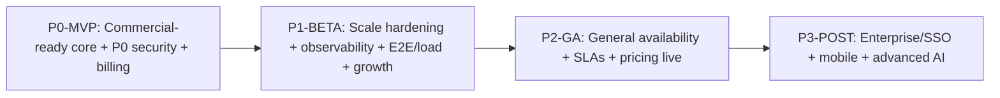

# 05 — Roadmap

Four phases take CheckMyData.ai from "engineering prototype" to a scaled commercial SaaS.
Each phase lists what is in-scope, what is explicitly out-of-scope, the expected result,
and success metrics with exit criteria. Tasks reference `04-BACKLOG.md`.

Sequencing principle: **you cannot charge money safely until the P0 security holes and the
billing build land together.** MVP therefore bundles the launch-blocking security fixes
with the commercialization layer.

---

## Phase P0 — MVP (Commercial-ready core)

**Theme:** Make it safe to take money and trust the core loop.

**In scope (backlog):**
- Security launch blockers: `T-SEC-1` (MCP auth/tenancy), `T-SEC-2` (WS token),
  `T-SEC-3` (cookie sessions/CSRF), `T-SEC-4` (SSH host-key), `T-SEC-6` (CSP/HSTS).
- Reliability blocker: `T-ARCH-5` (bound query results / MySQL OOM).
- Billing end-to-end: `T-BILL-1..7` (model, entitlements, Checkout, Portal, webhook,
  budget enforcement, billing UI/paywall).
- Pricing page: `T-GROW-1`.
- Observability baseline: `T-OBS-1` (Sentry + audit logs).
- UX gate: `T-UX-1` (auth-gate dashboard/app routes).
- Quality honesty: `T-QA-1` (align coverage gate + docs).

**Out of scope (deferred):** multi-dyno Redis externalization (limited dyno count in MVP),
god-file refactors, admin console, programmatic SEO, native mobile, enterprise SSO.

**Expected result:** A user can sign up, connect a data source safely, run trustworthy
read-only queries, hit a limit, upgrade via Stripe, and manage their subscription — with no
known S1 security holes and with LLM spend bounded by enforced budgets.

**Success metrics / exit criteria:**
- All P0 backlog tasks meet their acceptance criteria.
- Zero open S1 findings (F-SEC-1..4, F-SEC-6, F-BIZ-1, F-ARCH-5 resolved).
- End-to-end paid upgrade works in a staging Stripe environment (webhook replay-safe).
- Enforced budget prevents over-limit LLM spend (demonstrated).
- CI coverage gate equals the documented value; pipeline green.
- Activation (first successful query in session 1) measurable and ≥ 40%.

---

## Phase P1 — Beta (Scale hardening & growth foundation)

**Theme:** Make it scale, observable, and discoverable; pay down the riskiest debt.

**In scope (backlog):**
- Scale: `T-SCALE-1` (Redis state externalization, stateless dynos),
  `T-SEC-7` (shared rate limiting).
- Architecture debt: `T-ARCH-1..4` (decompose god-files, converge orchestration, remove
  deprecated modules), `T-ARCH-6` (default-on feature decisions).
- Quality: `T-QA-2` (E2E), `T-QA-3` (load), `T-QA-4` (SAST/dep scan), `T-QA-5` (a11y),
  `T-DOC-1` (docs consistency).
- Cost: `T-OBS-2` (spend guardrails/alerting).
- UX: `T-UX-2` (wire/remove components), `T-UX-3` (titles/a11y).
- Admin: `T-ADMIN-1`, `T-ADMIN-2`.
- Legal: `T-LEGAL-1` (DPA/subprocessors/LLM disclosure), `T-LEGAL-2` (retention/deletion).
- Growth: `T-GROW-2` (SEO foundation), `T-BILL-8`/`T-BILL-9` (plan admin + overage),
  `T-SEC-5` (SSH pre-commands).

**Out of scope (deferred):** enterprise SSO/SAML, native mobile, programmatic SEO at scale,
landing CRO experiments (groundwork only).

**Expected result:** The platform scales horizontally with consistent behavior, errors and
costs are observed and alerted, critical journeys are covered by E2E and load tests, the
biggest code-risk hotspots are decomposed, and the legal/compliance basics needed for B2B
deals exist.

**Success metrics / exit criteria:**
- App runs correctly on ≥2 dynos under load (load test passes p50/p95 targets).
- No open S2 architecture/observability findings.
- E2E + load + SAST + a11y gates green in CI; coverage at the agreed Beta number.
- DPA + subprocessor list published; deletion request honored end-to-end.
- W4 retention of activated users trending toward target; free→paid conversion measurable.

---

## Phase P2 — Production Launch (GA)

**Theme:** Commit to reliability and pricing publicly.

**In scope:**
- Finalize pricing/packaging (resolve Needs-validation §1) and make pricing live.
- Commit SLAs/SLOs (uptime, p95 latency, query success rate) and alerting against them.
- Harden onboarding for activation target; complete growth SEO foundation.
- Raise coverage gate to the GA target (proposal 72%).
- Security review / penetration test pass; close any residual S2.

**Out of scope:** enterprise SSO, native mobile, advanced AI features (Post-launch).

**Expected result:** A publicly launched, paid SaaS with committed reliability, live
pricing, and a measured, converting funnel.

**Success metrics / exit criteria:**
- Uptime/SLO targets met for a sustained pre-GA window.
- Query success rate ≥ 95%; p95 answer latency within target.
- Activation ≥ 45%; free→paid ≥ 4% (30-day); NRR baseline established.
- No open S1/S2 findings; coverage at GA target; clean security review.

---

## Phase P3 — Post-launch improvements

**Theme:** Expand market and deepen capability.

**In scope (candidate):**
- Enterprise: SSO/SAML, audit-log export, advanced roles, zero-retention LLM tiers,
  custom DPAs.
- Mobile: native app (responsive web remains baseline).
- Advanced AI: more default-on retrieval, richer insight feed, proactive monitoring/
  anomaly detection on data.
- Growth at scale: `T-GROW-3` (programmatic comparison/alternative pages), `T-GROW-4`
  (landing CRO experiments), `T-ADMIN-3` (feature flags self-serve).
- Self-hosted/on-prem evaluation for enterprise (research).

**Out of scope:** write/ETL operations on customer databases (remains a non-goal).

**Expected result:** Up-market expansion (Team→Enterprise), broader acquisition channels,
and a deeper AI analyst.

**Success metrics:** Enterprise logos closed; NRR ≥ 100%; expansion revenue growth;
sustained organic acquisition from growth pages.

---

## Phase → finding coverage (assurance)

| Phase | Closes findings |
| --- | --- |
| P0-MVP | F-SEC-1, F-SEC-2, F-SEC-3, F-SEC-4, F-SEC-6, F-BIZ-1, F-BIZ-2, F-BIZ-3 (pricing), F-ARCH-5, F-FIN-1 (enforcement), F-UX-1, F-QA-1, F-SEC-8 |
| P1-BETA | F-ARCH-1, F-ARCH-2, F-ARCH-3, F-ARCH-4, F-ARCH-6, F-SEC-5, F-SEC-7, F-SEC-9, F-QA-2, F-QA-3, F-QA-4, F-UX-2, F-UX-3, F-LEGAL-1, F-OPS-1, F-FIN-1 (alerting) |
| P2-GA | Residual S2 closure, pricing finalized, SLO commitments |
| P3-POST | Enterprise/mobile/advanced (new scope, not audit debt) |

Every S1/S2 finding from `00-AUDIT-FINDINGS.md` is closed by the end of P1-BETA at the
latest, with all S1s closed in P0-MVP.
