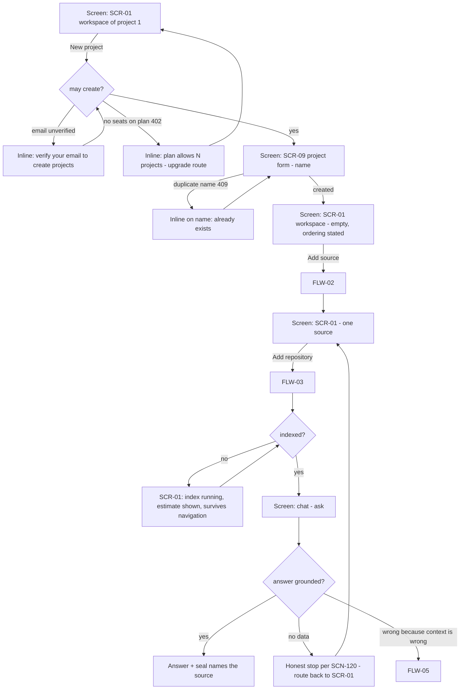
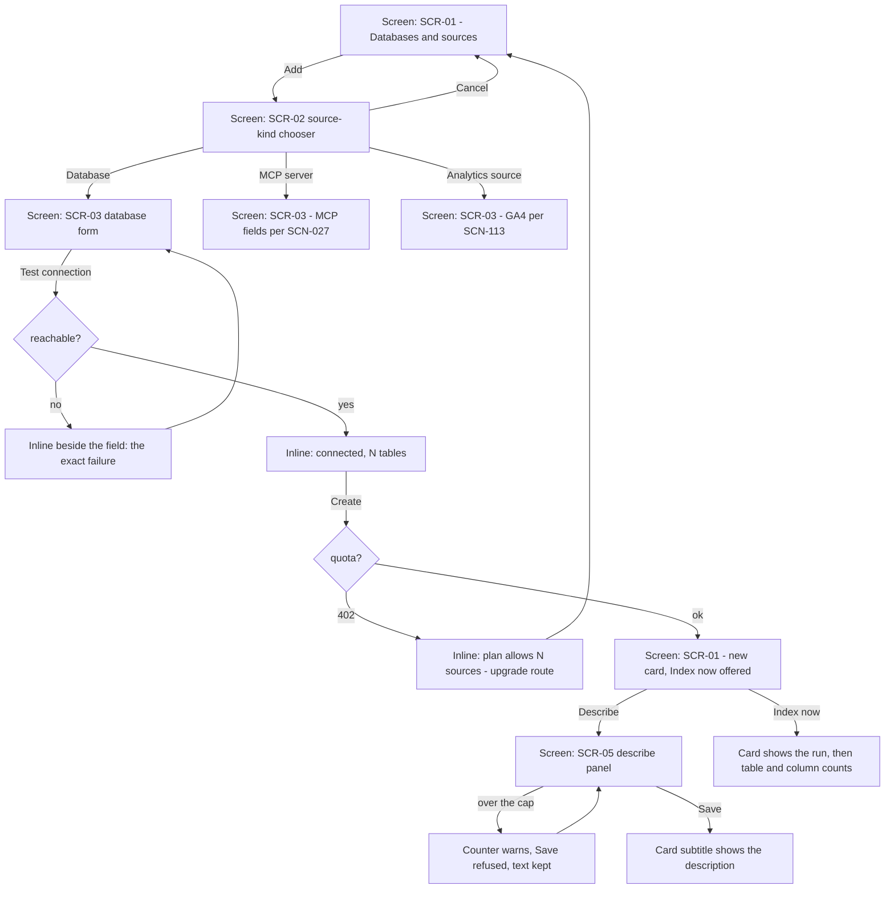
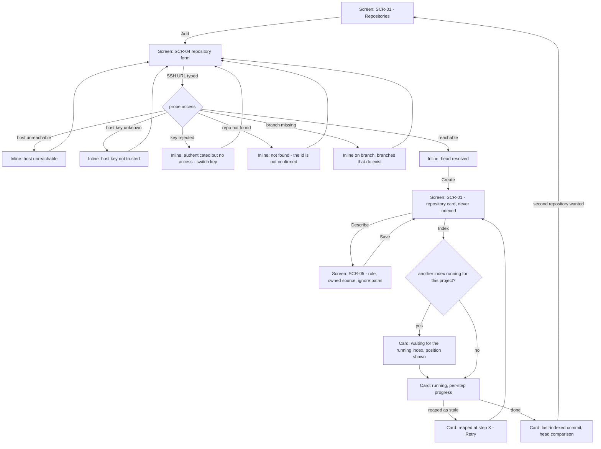
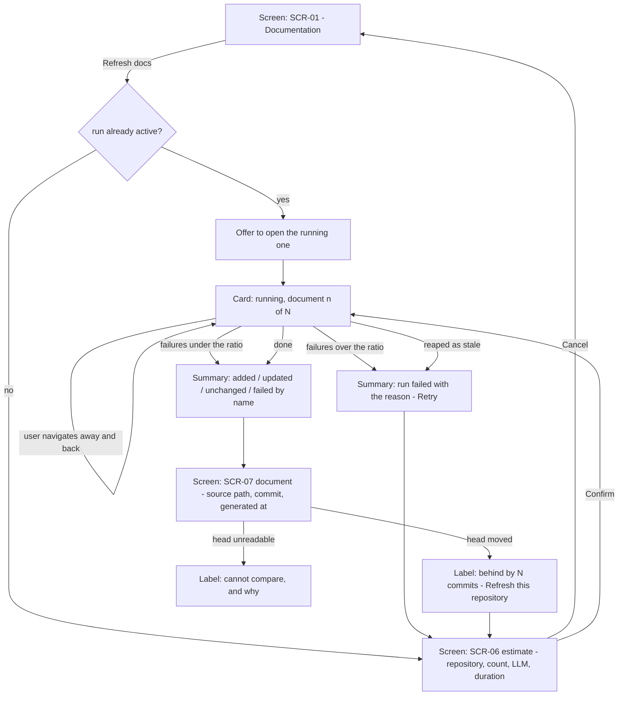
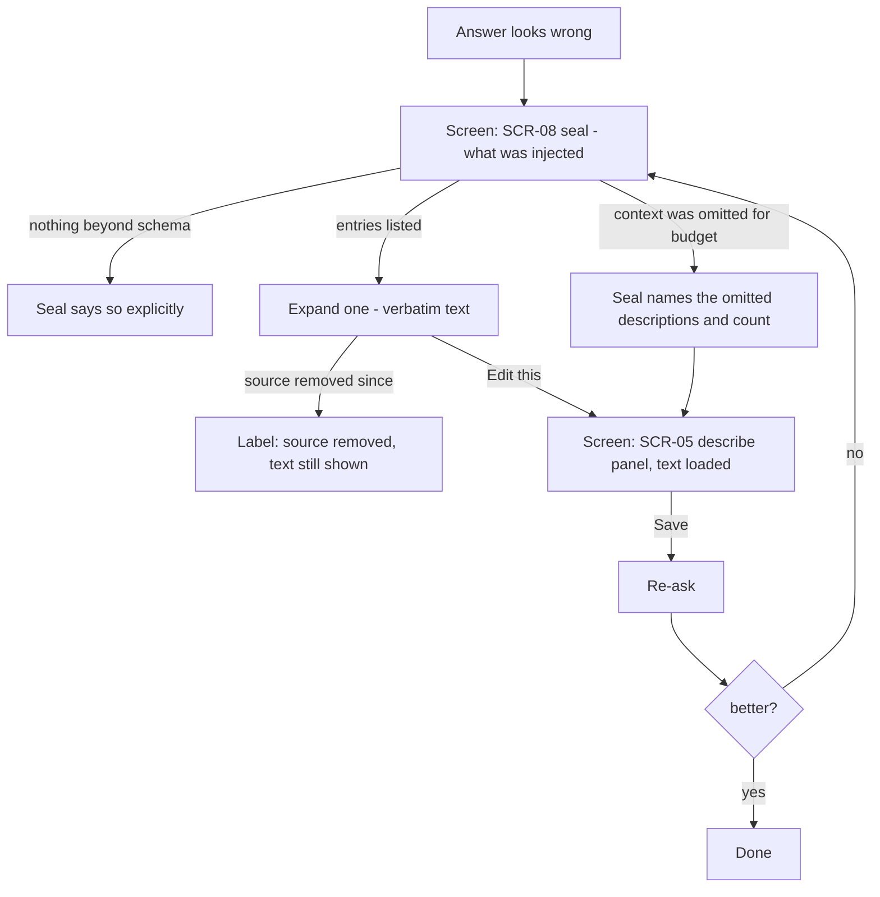

# UX Flows

<!-- Managed with super-ux (ux-contract v4). The HOW layer: task analysis and user flows scenarios trace to. -->

Created 2026-09-07 for the **data-onboarding** scope: a user who already has one
project connects a second one, attaches several typed data sources and one or more
repositories, tells the agent what each is for, and keeps the generated
documentation as the source of truth. Screens are referenced by `SCR-ID` and
specified once in [screens.md](screens.md). Scenarios covering these nodes are
`SCN-129`–`SCN-145` in [scenarios.md](scenarios.md).

## No foundation — the declared shape

`docs/ux/foundation.md` carries this project's standing design decisions but **no
personas, jobs or user stories**: personas live inline in `scenarios.md` (v1 mode)
and there are no `ST-`/`JTBD-` ids to trace to. Per `ux-flows` step 0 the work
proceeds in a declared shape rather than by inventing them. `ux-foundation` is
still the right next step for the WHY layer, and `Traces:` below name provisional
jobs in the operator's own words, to be replaced with ids when it lands.

### Provisional profile

| Dimension | Value | Source |
|---|---|---|
| Who moves through these flows | the project owner, technical, connects their own production databases | brief |
| Why a second project | one workspace per product/estate, not per question | brief |
| What "done" means | the agent answers a question about that estate correctly and says how it knows | inferred from `vision.md` §7 |
| Frequency | project setup is rare; describing and re-indexing is recurring | inferred |
| Team size at setup | one person, occasionally handing to an editor | assumed |
| Tolerance for a long wait | high **if** progress and cost are stated up front; the first index measures 3.3–3.4 h | brief + measured |
| Whether an unpaid project may be set up | yes, and it may be used by hand; only unattended work is withheld | **decided 2026-09-07** |

**All four decisions were taken on 2026-09-07 and are struck through below.** No
screen in this scope is `blocked` any more, and no flow branch is contingent. What
remains is build work, not design questions.

The last row was the one that decided a flow's shape, and the answer was neither of
the two options the table offered: an unpaid project is **not** blocked and **not**
fully served. Setup and hand-driven use stay open; scheduled work needs a
subscription. So FLW-01 gains no paywall branch at its head, and `SCR-01` gains a
disabled sync-hour control instead of a blocked state.

### Open decisions

| # | Decision | What it changes |
|---|---|---|
| ~~D1~~ | **Decided 2026-09-07: several repositories. Revised 2026-09-08: one repository, deferred not cancelled.** | The reversal came from measuring the cost rather than from changing minds about the value. `save_incremental` merges the code graph **by file path within a project**, and a file path is only unique inside a repository — so two repositories sharing `README.md` or `src/index.ts` would silently delete each other's symbols on every incremental run. The work is therefore not a column but a change of identity, from `(project, path)` to `(repository, path)`, in seven places plus the symbol `uid`; and moving the `uid` triggers a full rebuild, measured at 3.3 h on the one real repository. FLW-03 keeps its multi-repository branch on paper. `SCN-138`/`SCN-140`/`SCN-141`/`SCN-142`/`SCN-143` stay `draft` and are **parked, not retired** — the decision was to do it later, and retiring them would erase the design rather than the schedule |
| ~~D2~~ | **Resolved 2026-09-07: yes — setup and manual use stay open, scheduled work does not.** | No paywall at FLW-01's head. The entitlement layer gains a fourth question (may this account run unattended work?), answered `no` by `_no_plan()` and `yes` by the permissive default, so a self-hosted build keeps its automation. `SCN-146`, `SCN-147`, `SCN-148` carry it; `SCN-101a` changed and dropped back to `draft` |
| ~~D3~~ | **Resolved 2026-09-07: one free-text field.** | `SCR-05` is a single capped textarea for the description an agent reads. It decides the *description* only: a repository's ignore list stays a structured list because the extractor consumes it as file patterns, not the model as prose, and no free-text sentence can drive a mechanical filter |
| ~~D4~~ | **Resolved 2026-09-07: the rail loses management and is rebuilt around two questions.** | Thirteen collapsible sections become a fixed project switcher, a conditional `Needs you` group, five flat navigation entries and one recent-chat list. `SCN-149` specifies the rail, `SCN-150` the attention group, and `SCN-025`–`SCN-037` are edited in the same change per the `SCN-133` reconciliation |

## References read

Swept Mobbin (`web`) for shipped source-connection flows on 2026-09-07 — three
returned, and each changed something:

- **Basedash, "Adding a source"** — grouped the source kinds at the moment of
  adding (Warehouse / Database / Other) instead of one flat list, which is
  `SCR-02`; and its per-source menu carries **Edit description** beside
  **Sync schema — less than a minute ago**. That is this scope's per-source
  context and freshness, already shipped by someone else, so `SCR-05` is a
  known shape rather than an invention and `SCR-01` prints freshness *on the
  action* rather than in a separate line.
- **Sana AI, "Integrations"** — connected sources as a **table** with a status
  column, and available ones as a card catalogue beneath. This is the losing
  alternative recorded under FLW-02's rejected shape.
- **Qatalog, "Connections"** — a security note sitting next to the list rather
  than in a help page. Adopted into `SCR-01`, because this product stores
  database credentials and says so in `SECURITY.md` only.

Refero and Lazyweb were not swept: Refero exposes only `authenticate` in this
session (a registered server nobody has signed into exposes nothing), and one
structured corpus was enough to settle the two shape questions above.

---

## FLW-01: Second project answers its first question

- **Traces:** provisional job — *"I have another product with its own databases and
  code; I want the agent to answer questions about it without mixing it into the
  first one"* (operator's words, 2026-09-07)
- **Goal:** a second project exists, has at least one source and one repository, and
  has returned one correct answer with a visible provenance
- **Entry points:** sidebar "New project"; `SCR-01` of an existing project → project switcher
- **Success exit:** an answer in the new project's chat whose seal names the source it used
- **Task analysis:**
  1. Create the project (name only — everything else is changeable later)
  2. Connect a data source, because nothing downstream is scheduled without one
  3. Connect a repository
  4. Say what each is for
  5. Index, and wait with the cost known
  6. Ask a question; read the provenance
- **First-value step:** step 6. Everything before it is setup, and step 2 is the
  earliest point at which the product can answer anything at all — which is why
  `SCR-01`'s empty state names it as first rather than listing three equal options.
- **Rejected shape:** a linear wizard covering all six steps, like the existing
  onboarding of `SCN-001`. Lost because this user already owns a project: a wizard
  re-teaches what the product is, cannot be re-entered per source, and has nowhere
  to put the second repository. The workspace is re-enterable and each group can be
  completed on its own day.
- **Flow:**

- **Screens traversed:**

  | Screen | States used here |
  |--------|------------------|
  | SCR-01 Data workspace | empty, loading, error, success |
  | SCR-09 Project form | error, success |
  | SCR-08 Answer seal | empty, success |

- **Drop-off points** (each measured, not supposed):

  | # | Where | Cause | What the flow does about it |
  |---|---|---|---|
  | 1 | at `New project` | `base` allows **1** project, so the second is a `402` | The plan's project count is stated on the button's tooltip before the click, not after — otherwise the user learns their plan from a failure |
  | 2 | at `New project` | `can_create_projects` is `False` by default and the two refusals differ | Already correct in code; the flow keeps them distinguishable |
  | 3 | after `Add repository`, silently | the nightly wave skips a project with **no active connection**, so a repository connected first never indexes and nothing says so | `SCR-01` states the ordering (`SCN-131`) and the Repositories group labels the consequence in place |
  | 4 | during the first index | it measures **3.3–3.4 h**; a spinner with no estimate reads as broken | The estimate and per-step progress are stated before the run starts (`SCR-01`, `SCN-144`) |
  | 5 | at the second repository | it is created and **never indexed** (`400` on index, measured) | Recorded as D1; until it is decided the group admits one repository per project rather than accepting a row that does nothing |
  | 6 | the night after setup | two projects default to the **same sync hour**; two concurrent indexes need ~830 MiB against a 512 MiB worker quota | The workspace exposes the per-project sync hour, which today exists only as an API route with no interface |

## FLW-02: Connect a data source and say what it is for

- **Traces:** provisional job — *"different connections, and I can even tell it what
  the source is used for so the agent understands the task context"*
- **Goal:** a source is connected, verified, described, and its capability is visible
- **Entry points:** `SCR-01` → Databases & sources → Add; `SCR-01` → source card → Describe
- **Success exit:** a card on `SCR-01` showing type, capability, freshness and the first line of its description
- **Task analysis:**
  1. Choose what kind of source it is
  2. Prove it connects, before saving
  3. Save
  4. Say what it is for
  5. Index it
- **Rejected shape:** the connected list as a **table with a status column** (Sana AI's
  Integrations). Lost on one property of this product: a source here carries a
  free-text description and a capability sentence, and both are unreadable in a table
  cell. A table wins when the columns are short and comparable; these are not.
  Revisit at roughly twenty sources per project, where scanning beats reading.
- **Flow:**

- **Screens traversed:**

  | Screen | States used here |
  |--------|------------------|
  | SCR-01 Data workspace | success |
  | SCR-02 Source-kind chooser | success |
  | SCR-03 Source form | loading, error, success |
  | SCR-05 Describe panel | empty, loading, error, success |

- **Drop-off points:**

  | # | Where | Cause | What the flow does about it |
  |---|---|---|---|
  | 1 | at the name field | an empty name **silently returns** in today's form — the button appears dead | `SCR-03` shows an inline required error and focuses the field |
  | 2 | at an SSH-tunnelled source | host without user or key is only a toast today | Inline on the offending field |
  | 3 | at Describe | nobody writes a description if its effect is invisible | `SCR-05` states that the text reaches the agent, and `SCR-08` proves it did |

## FLW-03: Connect one or several repositories, with context

- **Traces:** provisional job — *"connect a repository or several, and set context so we
  see what the data is formed from"*
- **Goal:** each repository is attached with its role, its owned data source and its
  ignore list, and indexes independently
- **Entry points:** `SCR-01` → Repositories → Add; today the same fields sit inside the project form
- **Success exit:** a repository card with a last-indexed commit, and code answers attributing files to it
- **Task analysis:**
  1. Name it and point at it
  2. Prove the key can read it
  3. Say what it is and what to skip
  4. Index it
  5. Read an answer that names it
- **Rejected shape:** keeping the repository as one URL field on the project form,
  as it is today. Lost for a reason that is not aesthetic: a project's repository has
  its own key, branch, index run, freshness and failure state, and a field on another
  object's form has nowhere to put any of them — which is exactly why re-indexing had
  to be borrowed from the Knowledge Health panel of `SCN-062`.
- **Flow:**

- **Screens traversed:**

  | Screen | States used here |
  |--------|------------------|
  | SCR-01 Data workspace | loading, error, success |
  | SCR-04 Repository form | loading, error, success |
  | SCR-05 Describe panel | empty, error, success |

- **Drop-off points:**

  | # | Where | Cause | What the flow does about it |
  |---|---|---|---|
  | 1 | at the access probe | "could not connect" for five different causes leaves nothing to act on | Five distinguished messages; the not-found one deliberately does not confirm the id (`SCN-121`) |
  | 2 | at the second repository | the row is written and no consumer reads it | The `G` branch serialises indexes and D1 decides whether the branch exists at all |
  | 3 | at Index, concurrently | one index peaks at 415 MiB against a 512 MiB quota, so two is the kill this product has had | The `G` decision is a queue, not a parallel start — a requirement, not an optimisation |
  | 4 | after a deploy mid-index | a queue position is not a promise a restarted process keeps | The waiting card says the queue was lost and offers the action again |

## FLW-04: Refresh the documentation and keep it the source of truth

- **Traces:** provisional job — *"update the docs, update the wiki, so documentation is
  the main source of truth"*
- **Goal:** documents are regenerated, each carries its provenance, and stale ones say so
- **Entry points:** `SCR-01` → Documentation → Refresh docs; `SCR-07` stale label
- **Success exit:** a change summary, and documents labelled `current` against the repository head
- **Task analysis:**
  1. See how many documents are due and what refreshing costs
  2. Decide
  3. Watch it, or leave and come back
  4. Read what changed
- **Rejected shape:** a refresh that starts on click with a spinner. Lost because this
  step calls an LLM once per document and measures ~4.8 documents a minute — 758
  documents is over two hours and real money. A button that hides that is a button
  people press twice.
- **Flow:**

- **Screens traversed:**

  | Screen | States used here |
  |--------|------------------|
  | SCR-01 Data workspace | success |
  | SCR-06 Refresh estimate | success |
  | SCR-07 Document viewer | loading, empty, error, success |

- **Drop-off points:**

  | # | Where | Cause | What the flow does about it |
  |---|---|---|---|
  | 1 | at the button | a two-hour LLM job that looks instant gets pressed repeatedly | `SCR-06` states scope, cost and duration before starting |
  | 2 | mid-run | the user closes the tab and assumes it died | The run is server-side and the card is restored on return |
  | 3 | after the run | "completed" with no diff cannot be told from "did nothing" | The summary counts added, updated, unchanged and failed-by-name |
  | 4 | reading a document | a stale document read as current is worse than no document | `SCR-07` labels `current` / `behind by N` / `provenance unknown`, and never defaults to current |

## FLW-05: Correct what the agent was told

- **Traces:** provisional job — *"so we see what the data is formed from"*
- **Goal:** a wrong answer is traced to the instruction that caused it, and that
  instruction is corrected at its source
- **Entry points:** any answer's seal; `SCR-01` source card
- **Success exit:** the description is changed and the next answer reflects it
- **Task analysis:**
  1. See what the agent was told, verbatim
  2. Find the wrong sentence
  3. Change it where it lives
  4. Re-ask
- **Rejected shape:** correcting the answer itself with feedback (`SCN-052`). Lost
  because feedback trains a learning while the wrong *instruction* stays in the
  prompt: the same error returns on the next question and the user cannot see why.
  This flow edits the cause; `SCN-052` remains for the cases where the cause is not
  an instruction.
- **Flow:**

- **Screens traversed:**

  | Screen | States used here |
  |--------|------------------|
  | SCR-08 Answer seal | empty, success |
  | SCR-05 Describe panel | loading, error, success |

- **Drop-off points:**

  | # | Where | Cause | What the flow does about it |
  |---|---|---|---|
  | 1 | at the seal | an instruction the user cannot see cannot be corrected | Every injected text is listed verbatim, including rules and learnings |
  | 2 | at the budget cap | a silently dropped description makes the answer inexplicable | Whole descriptions are dropped, never parts, and the omission is named (`SCN-136`) |

---

## Coverage against scenarios

| Flow | Nodes covered by |
|---|---|
| FLW-01 | SCN-016, SCN-100, SCN-129, SCN-131, SCN-120 |
| FLW-02 | SCN-025, SCN-026, SCN-027, SCN-030, SCN-113, SCN-130, SCN-132, SCN-134 |
| FLW-03 | SCN-137, SCN-138, SCN-139, SCN-140, SCN-141, SCN-142, SCN-143, SCN-121 |
| FLW-04 | SCN-061, SCN-062, SCN-144, SCN-145 |
| FLW-05 | SCN-052, SCN-122, SCN-135, SCN-136 |

Every node and error edge above has a scenario, and after the 2026-09-07 decisions
no flow rests on an open question. Two nodes gained scenarios with those decisions:
FLW-01's overnight step is now `SCN-146`/`SCN-147` (the schedule that does not run
without a subscription, and how it says so), and the rail every flow starts from is
`SCN-149`/`SCN-150`.
